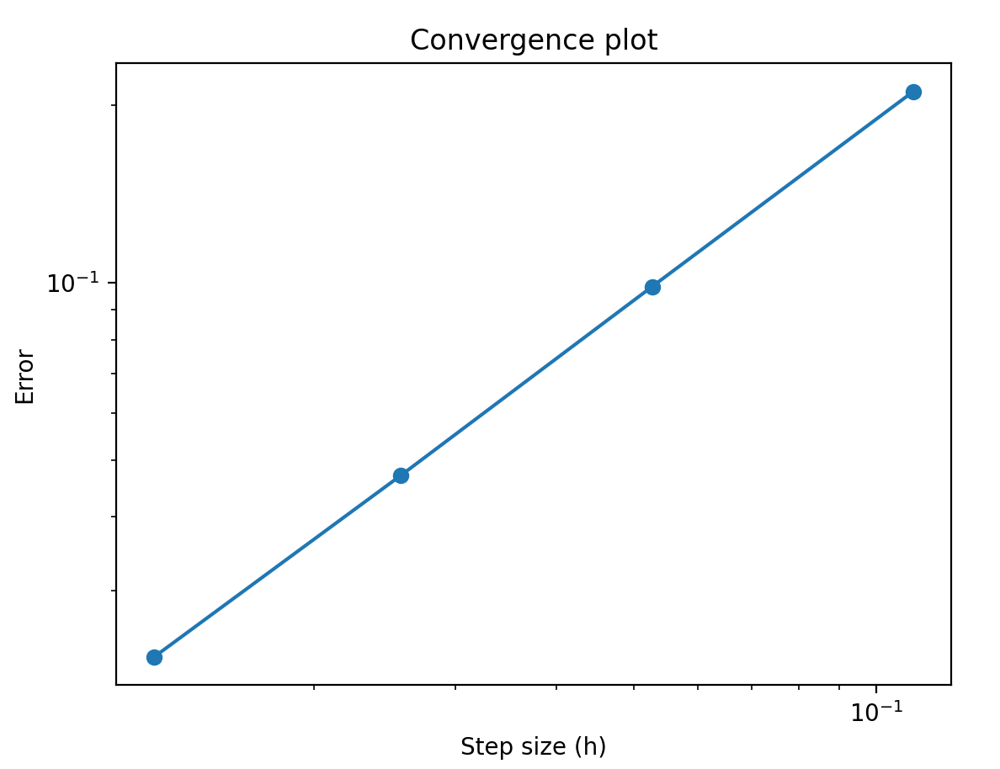
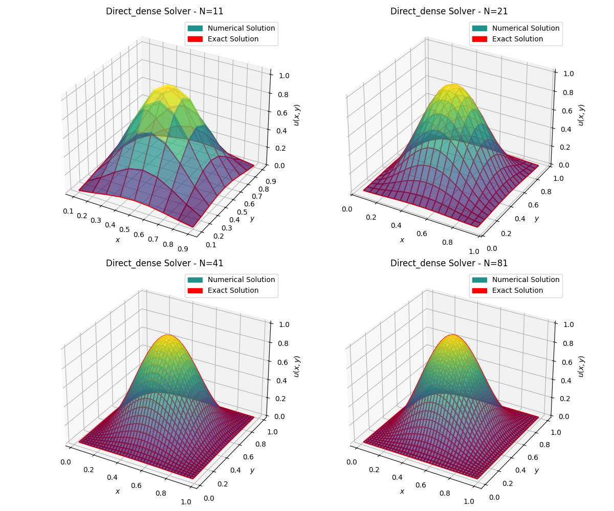
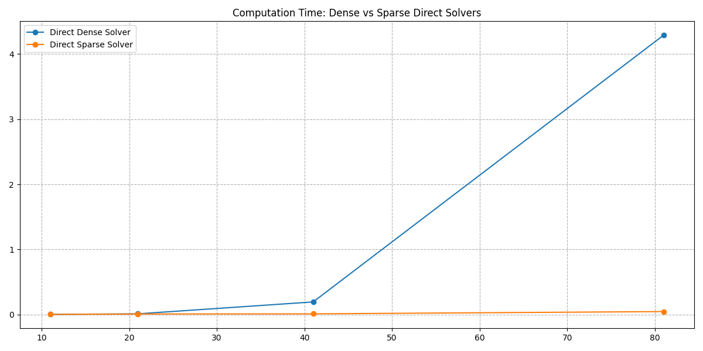
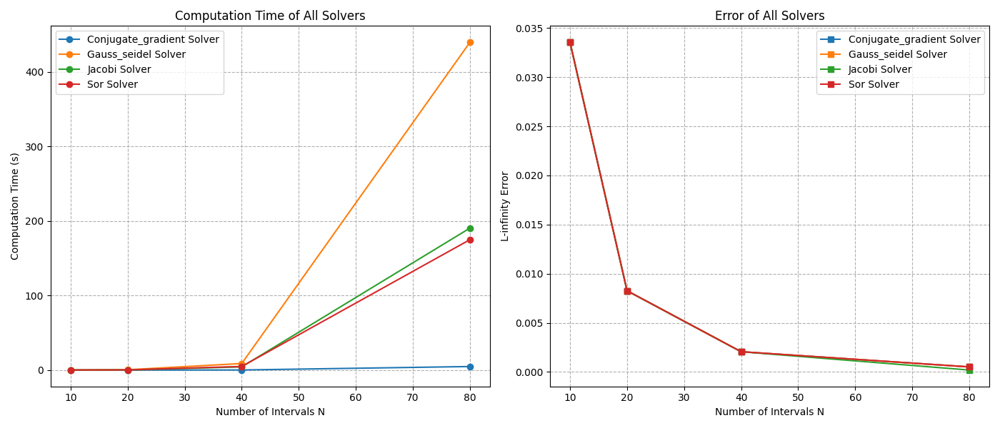
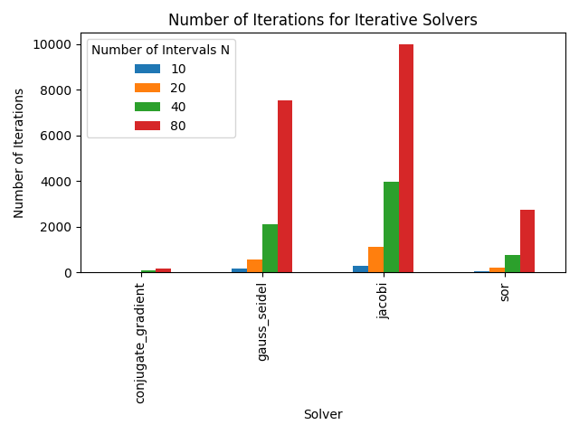
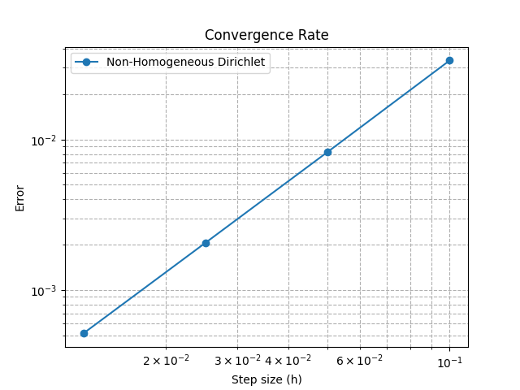
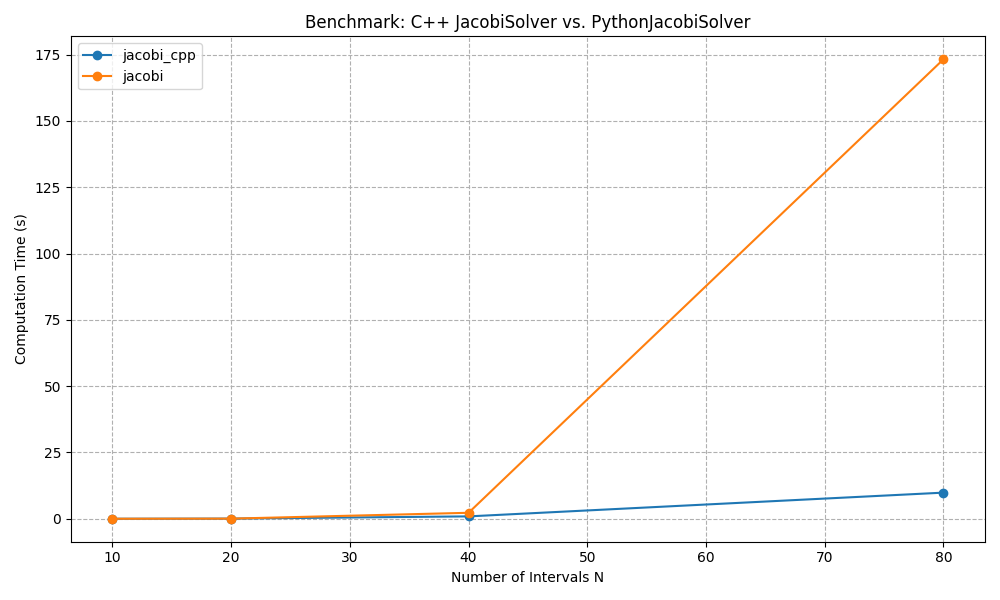
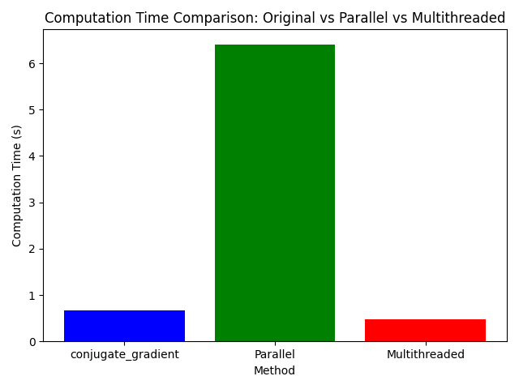
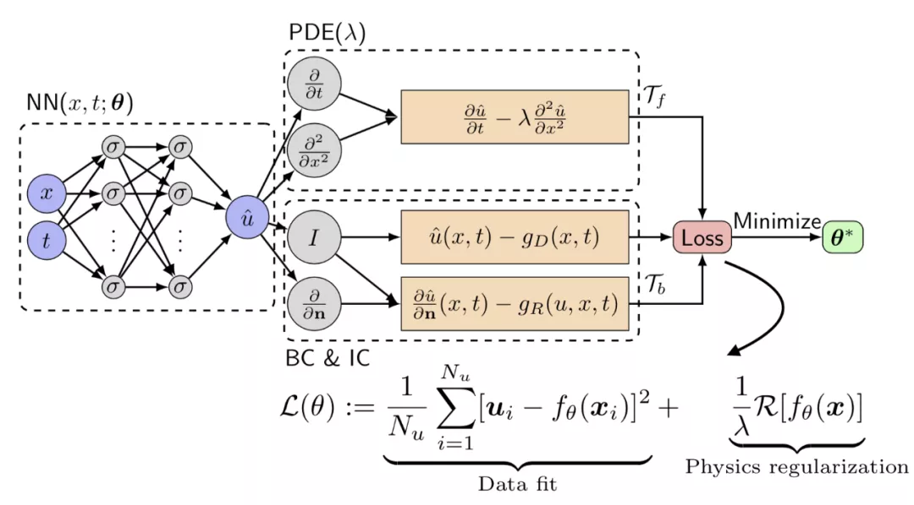
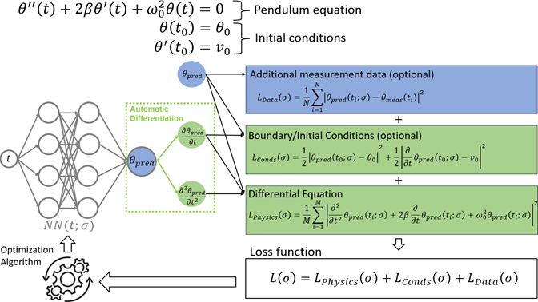

<script type="text/javascript" src="http://cdn.mathjax.org/mathjax/latest/MathJax.js?config=TeX-AMS-MML_HTMLorMML"></script>
<script type="text/x-mathjax-config">
  MathJax.Hub.Config({ tex2jax: {inlineMath: [['$', '$']]}, messageStyle: "none" });
</script>

# 2D Poisson Problem

## **🛠 Project Roadmap: Numerical PDE Solver**  
**Motivation**: Inspired by DeepSeek and my upcoming **Numerical PDE** course, I aim to contribute to the open community.  

---

### **Numerical PDE Package**  

**📌 Methods**
✅ **Finite Difference Method (FDM)**  
❌ **Finite Element Method (FEM)**  
❌ **Finite Volume Method (FVM)**  

⬇️  **Applied to solving**  
✅ **Laplacian/Poisson Equation**  
❌ **Heat Equation**  
❌ **Wave Equation**  

⬇️  **Boundary Conditions**  

✅ **Dirichlet Boundary Conditions**  
✅ **Neumann Boundary Conditions**  
✅ **Regular Grids** | ❌ **Irregular Grids**  

**🛠 Solvers and Techniques**  
**1️⃣ Direct Methods**  
✅ LU Decomposition  

**2️⃣ Iterative Methods**  
✅ Jacobi | ✅ Gauss-Seidel | ✅ SOR | ❌ Multigrid  

**3️⃣ Advanced Methods**  
✅ PINN

---

### **Main Metrics for Measuring a System**
When evaluating the performance of a system, there are several key metrics:

1. **Throughput**  
   - Measures the number of tasks (requests, transactions, operations) a system can handle per unit of time.
   - Example: A web server handling 10,000 requests per second.

2. **Concurrency**  
   - Measures how many tasks can be processed simultaneously.
   - Related to multi-threading, async execution, and parallel processing.

3. **Latency**  
   - The time delay between input and output (e.g., request and response).
   - Lower latency is often better.
   - Example: Database query latency of 50ms.

4. **Response Time**  
   - The total time a system takes to respond to a request.
   - Includes network delay, processing time, and queue time.


### **Characteristics of Numerical Algorithms**
Numerical algorithms solve mathematical problems using numerical approximations. Their characteristics include:

1. **Accuracy**  
   - How close the numerical solution is to the exact solution.

2. **Stability**  
   - A small error should not grow uncontrollably.

3. **Convergence**  
   - Whether the numerical solution approaches the true solution as the step size decreases.

4. **Computational Complexity**  
   - Measures the time and space required for computation.
   - Example: Matrix inversion is \(O(n^3)\), while iterative solvers like Conjugate Gradient are more efficient. 
   - **VC (Vapnik-Chervonenkis) dimension** dimension was historically used to measure the complexity of a hypothesis class in machine learning, which was useful in classical learning theory (e.g., SVMs, logistic regression) but is not practical for modern ML, especially deep learning. More refined theories like **Rademacher complexity**, **PAC-Bayes**, and **margin-based bounds** are now preferred for analyzing generalization.

5. **Condition Number**  
   - Sensitivity of the problem to small input changes.
   - High condition number → small errors get amplified.

6. **Numerical Stability**  
   - How errors propagate in computations.
   - Example: Gaussian elimination with pivoting is more stable.

### **🚀 Optimizations & Enhancements**  
| **Category** | **Status** | **Plan** |
|-------------|-----------|----------|
| **Data Structures** | ✅ | |
| **Speed & Security** | ✅ (Jacobi in C++) | Extend to other solvers |
| **CUDA Acceleration** | ❌ | Implement GPU-based solvers |
| **Neural Networks** | ✅ PINN demo | Improve inference (ONNX, CUDA optimization) |
| **Parallel Programming** | ✅ Python Multiprocessing & Multithreading | ❌ OpenMP, ❌ MPI |
| **User Interface (UI)** | ❌ | Design an interactive visualization tool |
| **Other Improvements** | ❌ | List additional enhancements |

---

### **Data Structures Have Less Impact on Numerical Algorithms**
Unlike general algorithms where data structures play a key role in performance optimization (e.g., hash tables, trees, heaps), **numerical algorithms are mostly about mathematical optimization rather than data structure design**. The reasons are:

1. **Focus on Matrix and Vector Operations**  
   - Most numerical methods (e.g., PDE solvers, optimization algorithms) rely on linear algebra.
   - Sparse matrices can reduce complexity, but data structures like trees or heaps are rarely used.

2. **Computational Efficiency Over Storage Efficiency**  
   - The bottleneck is often **floating-point operations**, not data lookup speed.

3. **Parallelism and Vectorization Matter More**  
   - Performance gains come from efficient **vectorized operations**, not fancy data structures.
   - Example: Using BLAS/LAPACK or GPU acceleration(Cuda, C/C++helps).

---

## 1. Designing the Solver

### 1.1 Generating the Grid

To solve the 2D Poisson equation numerically, we first discretize the domain using a rectangular grid. Given $Nx$ and $Ny$ as the number of intervals in the x and y directions respectively, the total number of grid points including boundaries is $(Nx-1) \times (Ny-1)$.

**Grid Generation**:
- Generate a grid of interior points (excluding boundaries) with dimensions $(Nx-1) \times (Ny-1)$.
- Each interior point is denoted as $(x_i, y_j)$ where $i \in \{1, \ldots, Nx-1\}$ and $j \in \{1, \ldots, Ny-1\}$.
- Utilize the `numpy.meshgrid` function to create coordinate matrices for these points.

```python
h = 1.0 / (n - 1)
nx = n - 2  # Number of interior points
xi = np.linspace(h, 1 - h, nx)  # Interior points only
yi = np.linspace(h, 1 - h, nx)  # Interior points only
x, y = np.meshgrid(xi, yi)
```

- **Explanation**:
    - **Grid Spacing (`h`)**: Determines the distance between adjacent grid points. By setting $h = \frac{1}{n-1}$, we ensure a uniform grid over the domain $[0, 1]$.
    - **Interior Points (`n_x`)**: We exclude the boundary points to focus on the interior where the Poisson equation is solved. This results in $n_x = n - 2$ interior points in each direction or using $h = \frac{1}{n}$ results in $n_x = n - 1$ interior points in each direction. 
    - **Generating Coordinates (`x_i`, `y_i`)**: `np.linspace` generates evenly spaced points between $h$ and $1 - h$, ensuring that boundary points at $0$ and $1$ are excluded.
    - **Meshgrid (`x`, `y`)**: `np.meshgrid` creates 2D coordinate matrices from the 1D arrays `x_i` and `y_i`, facilitating vectorized computations for the grid points.

- [ ] **adjust for arbitrary domain**

### 1.2 Approximation

#### **1️⃣ Finite Difference Method (FDM)[^1] ✅**  

**Key Idea**: Approximate derivatives using **finite difference approximations** on a structured grid.  

🔹 **Concept**:  
- Replace **derivatives** with difference equations using **Taylor series expansions**.  
- Typically used on **uniform grids**.  
- Measure the difference, which is widely used, like in Graph Theory.

🔹 **Example: 1D Second-Order Derivative Approximation**  
$$
\frac{d^2 u}{dx^2} \approx \frac{u_{i-1} - 2u_i + u_{i+1}}{h^2}
$$
where $h$ is the grid spacing.  

🔹 **Example: Discrete Laplacian in 2D**:
- Apply the finite difference formula to both x and y directions.
- Combine the partial derivatives to form the discrete Laplacian:

$$
\Delta u_{i,j} = \frac{u_{i+1,j} - 2u_{i,j} + u_{i-1,j}}{h^2} + \frac{u_{i,j+1} - 2u_{i,j} + u_{i,j-1}}{h^2}
$$

- Simplify with a uniform grid ($h_x = h_y = h$):

$$
\Delta u_{i,j} = \frac{u_{i+1,j} + u_{i-1,j} + u_{i,j+1} + u_{i,j-1} - 4u_{i,j}}{h^2}
$$

- Let $u_{i,j}$ represent the unknowns at grid points.

🔹 **Advantages**:  
✅ Simple to implement  
✅ Efficient for structured grids  

🔹 **Disadvantages**:  
❌ Hard to handle complex geometries  
❌ Requires finer grids for high accuracy  

---

#### **2️⃣ Finite Element Method (FEM)[^2] ❌**  

**Key Idea**: Approximate the PDE solution using **piecewise basis functions** over an unstructured mesh.  

🔹 **Concept**:  
- Divide the domain into small **elements** (triangles, quadrilaterals in 2D, tetrahedra in 3D).  
- Use **basis functions** (e.g., polynomials) to approximate the solution inside each element.  
- Convert the PDE into a **system of algebraic equations** using **variational principles** (like the weak form).  

🔹 **Advantages**:  
✅ Works well for **complex geometries**  
✅ Highly accurate with adaptive mesh refinement  

🔹 **Disadvantages**:  
❌ More complex implementation than FDM  
❌ Computationally expensive  

---

#### **3️⃣ Finite Volume Method (FVM)[^3] ❌**  

**Key Idea**: Convert the PDE into **integral form** and enforce conservation over control volumes.  

🔹 **Concept**:  
- Divide the domain into small **control volumes** (cells).  
- Integrate the PDE over each control volume.  
- Use fluxes across cell boundaries to enforce conservation.  

🔹 **Example: Conservation Law Formulation**  
$$
\int_{\Omega_i} \frac{\partial u}{\partial t} d\Omega + \int_{\partial \Omega_i} \mathbf{F} \cdot d\mathbf{S} = 0
$$
where **$\mathbf{F}$** represents flux terms.  

🔹 **Advantages**:  
✅ **Naturally conservative**, making it great for **fluid dynamics (CFD)**  
✅ Handles complex geometries better than FDM  

🔹 **Disadvantages**:  
❌ More complex than FDM  
❌ Can be less accurate for smooth problems compared to FEM  

---

#### **🔎 Summary Table: Choosing a Method**
| Method | Grid Type | Best For | Accuracy | Computational Cost | Strengths |
|--------|----------|---------|----------|-----------------|-----------|
| **FDM** | Structured | Simple PDEs | Moderate | Low | Fast, easy to implement |
| **FEM** | Unstructured | Complex domains | High | High | Flexible, high accuracy |
| **FVM** | Unstructured | Conservation laws | Moderate | Medium | Conservative, good for fluid flows |

[^1]: Wikipedia: https://en.wikipedia.org/wiki/Finite_difference_method
[^2]: Wikipedia: https://en.wikipedia.org/wiki/Finite_element_method
[^3]: Wikipedia: https://en.wikipedia.org/wiki/Finite_volume_method
### 1.3 Matrix Formulation

**Matrix Representation of the Discrete Poisson Equation**:
- Arrange the unknowns $u_{i,j}$ into a global vector $\mathbf{u}$ using column-wise ordering:

$$
\mathbf{u} = \begin{bmatrix}
u_{1,1} \\
u_{2,1} \\
\vdots \\
u_{Nx-1,1} \\
u_{1,2} \\
\vdots \\
u_{Nx-1, Ny-1}
\end{bmatrix}
$$
which used `flatten()` to return a copy of the array collapsed into one dimension.

- The discrete Laplacian operator $\Delta_h$ can be expressed using the Kronecker product:

$$
\Delta_h = I_y \otimes T_x + T_y \otimes I_x
$$

where:
- $I_x$ and $I_y$ are identity matrices of size $Nx-1$ and $Ny-1$ respectively.
- $T_x$ and $T_y$ are tridiagonal matrices representing the second-order finite difference in x and y directions.


```python
def finite_difference(N, h):
    #  [0 − 1 1], [−1 1 0], or [−1 0 1] for the first derivatives
    #  [1 − 2 1] for the second derivatives
    e = np.ones(N)
    D = (np.diag(-2 * e) + np.diag(e[:-1], k=-1) + np.diag(e[:-1], k=1)) 
    D /= h**2
    return D

def discretize_poisson(Nx, Ny, h):
    Dx = finite_difference(Nx - 1, h)
    Dy = finite_difference(Ny - 1, h)
    Ix = np.eye(Nx - 1)
    Iy = np.eye(Ny - 1)
    L = np.kron(Iy, Dx) + np.kron(Dy, Ix)
    return L
```

- **Explanation**:
    - **Finite Difference Matrix (`finite_difference`)**:
        - **Diagonal Entries**: The main diagonal is filled with $-2/h^2$, representing the central coefficient in the finite difference approximation.
        - **Off-Diagonals**: The subdiagonal and superdiagonal are filled with $1/h^2$, representing the coefficients for $u_{i-1,j}$ and $u_{i+1,j}$ respectively.
        - This creates a tridiagonal matrix $T$ which models the second-order derivative in one dimension.
    - **Discretizing Poisson Equation (`discretize_poisson`)**:
        - **Kronecker Products**: 
            - $I_y \otimes T_x$ applies the finite difference operator in the x-direction across all y-indices.
            - $T_y \otimes I_x$ applies the finite difference operator in the y-direction across all x-indices.
        - **Combining Operators**: The sum $I_y \otimes T_x + T_y \otimes I_x$ effectively creates the 2D discrete Laplacian operator $\Delta_h$.
        - **Resulting Matrix (`A`)**: Represents the system matrix $A$ in the linear system $A\mathbf{u} = \mathbf{f}$.

    - In a 1D tridiagonal matrix $T$ of size $Nx-1$, the offsets usually refer to:
        - The main diagonal at offset 0,
        - The subdiagonal at offset -1,
        - The superdiagonal at offset +1.
- The linear system becomes:

$$
A\mathbf{u} = \mathbf{f}
$$

where $A = \Delta_h$ and $\mathbf{f} = \text{RHS}$.

**Incorporating Boundary Conditions**:
- For homogeneous Dirichlet boundary conditions ($u = 0$ on $\partial\Omega$):

$$
A\mathbf{u} = \mathbf{f} + \mathbf{b}
$$

where $\mathbf{b}$ accounts for the boundary conditions. Since the boundaries are zero, $\mathbf{b}$ remains zero. 

- For Dirichlet boundary conditions:

$$
u(x, y) = g(x, y) \quad \text{on the boundary}
$$

Define a **vector \( b \)** that modifies the right-hand side of the equation to include boundary terms.

For an **interior point \( (i, j) \)** near the boundary:
- If a neighboring point is on the **boundary**, its value is known.
- Instead of solving for that point, we **move it to the right-hand side**.

    $$- u_{i+1,j} - u_{i-1,j} - u_{i,j+1} - u_{i,j-1} + 4u_{i,j} = h^2 f_{i,j}$$

If \( u_{i+1,j} \) is on the boundary, replace it with \( g(x_{i+1}, y_j) \):

$$- g_{i+1,j} - u_{i-1,j} - u_{i,j+1} - u_{i,j-1} + 4u_{i,j} = h^2 f_{i,j}$$

Rearranging:

$$- u_{i-1,j} - u_{i,j+1} - u_{i,j-1} + 4u_{i,j} = h^2 f_{i,j} + g_{i+1,j}$$

Thus, the boundary condition contributes a term \( b \) to the system:

$$
A u = f + b
$$

where \( b \) contains terms from the **boundary values** of \( u \).


Therefore, for a **nonzero boundary condition** \( g(x, y) \), we must modify \( b \):

- If \( u(x, y) = g(x, y) \) on the boundary, we **modify the right-hand side** vector:

$$
b = h^2 f + \sum_{\text{boundary terms}} g
$$

- The effect of \( g \) appears only in the **boundary-adjacent rows** of $A$.

- For **Neumann boundary conditions** (where \( \frac{\partial u}{\partial n} = h \)), we modify the finite difference stencil to include the derivative approximation.

---

```python
class DirichletBoundaryCondition(BoundaryCondition):
    def __init__(self, g=None):
        self.g = g  # g is the boundary condition function

    def apply(self, F, X=None, Y=None):
        """Apply Dirichlet boundary conditions using the provided boundary function g"""
        f_bc = F.copy()
        if self.g is not None and X is not None and Y is not None:
            f_bc[0, :] = self.g(X[0, :], Y[0, :])    # Bottom boundary
            f_bc[-1, :] = self.g(X[-1, :], Y[-1, :])  # Top boundary
            f_bc[:, 0] = self.g(X[:, 0], Y[:, 0])    # Left boundary
            f_bc[:, -1] = self.g(X[:, -1], Y[:, -1])  # Right boundary
        else:
            f_bc[0, :] = 0  # Bottom boundary
            f_bc[-1, :] = 0  # Top boundary
            f_bc[:, 0] = 0  # Left boundary
            f_bc[:, -1] = 0  # Right boundary
        return f_bc
```

- **Explanation**:
    - **Abstract Base Class (`BoundaryCondition`)**:
        - Using an abstract base class allows for defining a common interface for different types of boundary conditions (e.g., Dirichlet, Neumann).
        - This promotes code reusability and flexibility, enabling easy extension for additional boundary conditions in the future.
    - **OOP Approach**:
        - Encapsulates boundary condition logic within classes, making the codebase organized and modular.
        - Facilitates maintenance and scalability, as each boundary condition type can be managed independently.
    - **`DirichletBoundaryCondition` Class**:
        - **Constructor (`__init__`)**: Accepts an optional boundary function `g` which defines non-homogeneous boundary conditions.
        - **`apply` Method**:
            - Copies the existing right-hand side vector `F`.
            - If a boundary function `g` is provided along with grid coordinates `X` and `Y`, it applies the non-homogeneous boundary conditions by evaluating `g` at the boundary points.
            - If no boundary function is provided, it defaults to homogeneous Dirichlet conditions by setting boundary values to zero.
        - **Benefits**:
            - **Flexibility**: Can handle both homogeneous and non-homogeneous Dirichlet boundary conditions based on user input.
            - **Modularity**: Boundary condition application logic is separated from the core solver logic, adhering to the single responsibility principle.

---

## 1.2 Validation of the Implementation

- **Exact Solution for Validation**:
    - Define an exact solution $u_{\text{ex}}(x, y) = \sin^2(\pi x) \sin^2(\pi y)$.
    - Compute the corresponding right-hand side $f(x, y)$:

    $$
    \Delta u = 2\pi^2 [\cos(2\pi x)\sin^2(\pi y) + \cos(2\pi y)\sin^2(\pi x)]
    $$
    
    $$
    f(x, y) = -\Delta u = -2\pi^2 [\cos(2\pi x)\sin^2(\pi y) + \cos(2\pi y)\sin^2(\pi x)]
    $$

- **Consistency with Boundary Conditions**:
    - The exact solution satisfies homogeneous Dirichlet boundary conditions since $\sin(0) = \sin(\pi) = 0$.

- **Error Computation and Convergence Plot**:
    - After solving the linear system, compute the relative error using the L-infinity norm:

    $$
    \text{Error} = \max_{i,j} |u_{\text{ex}}(x_i, y_j) - u_{i,j}|
    $$

    - Generate a log-log convergence plot showing error versus step size $h$.
    - The expected convergence rate is $\mathcal{O}(h^2)$.

    - the relative error in the maximum norm:
    
    $$
    \text{Relative Error} = \frac{\| u_{\text{computed}} - u_{\text{exact}} \|_\infty}{\| u_{\text{exact}} \|_\infty}.
    $$

### Convergence Plot

#### **Expected Convergence Rate:**
For second-order finite difference schemes, the error typically converges at $\mathcal{O}(h^2)$, where $h$ is the grid spacing.

#### **Computational Time Considerations:**
- As the number of grid points increases, the size of the system grows.
- Iterative solvers (e.g., Jacobi, Gauss-Seidel) may take more iterations for convergence.
- Direct methods scale poorly for large systems due to high computational cost.


#### **Observations:**
- The convergence plot should demonstrate the expected $\mathcal{O}(h^2)$ behavior.
- Computational time may increase significantly with finer grids.

---

## 2. Solving the Linear System

### 2.1 Direct Methods for solving Linear Systems $Ax = b$

##### **1️⃣ LU Decomposition Solver[^4]**  
🔹 **Method**: Factorizes a matrix $A$ into:  
$$
A = LU
$$
where:  
- $L$ is a **lower triangular matrix**  
- $U$ is an **upper triangular matrix**  

🔹 **Usage**: Solves $Ax = b$ in two steps:  
1. Solve $Ly = b$ using **forward substitution**  
2. Solve $Ux = y$ using **backward substitution**  

🔹 **Python Implementation:**  
```python
class LUdecompositionSolver(Solver):
    
    def solve(self, A, b):
        logging.info("LUdecompositionSolver: Solving system")
        if sp.issparse(A):
            # Use splu for sparse matrices
            lu = sp.linalg.splu(A)
            return lu.solve(b)
        else:
            lu, piv = lu_factor(A)
            return lu_solve((lu, piv), b)
```

---

##### **2️⃣ Cholesky Decomposition Solver[^5]**  
🔹 **Method**: If $A$ is **symmetric positive definite**, we can decompose it into:  
$$
A = LL^T
$$
where $L$ is a **lower triangular matrix**.  

🔹 **Python Implementation:**  
```python
class CholeskySolver(Solver):    
    
    def solve(self, L, b):
        logging.info("CholeskySolver: Solving system")
        if sp.issparse(L):
            L = L.toarray()  # Ensure L is a NumPy array

        # Check for symmetry
        if not np.allclose(L, L.T, atol=1e-8):
            logging.error("CholeskySolver: Matrix L is not symmetric.")
            raise ValueError(
                "Matrix L must be symmetric for Cholesky decomposition.")

        # Check for positive definiteness by verifying all eigenvalues are positive
        eigenvalues = np.linalg.eigvalsh(L)
        min_eig = np.min(eigenvalues)
        if min_eig <= 0:
            logging.error(
                f"CholeskySolver: Matrix L is not positive definite. Minimum eigenvalue: {min_eig}"
            )
            raise np.linalg.LinAlgError(
                f"Matrix L is not positive definite. Minimum eigenvalue: {min_eig}"
            )

        try:
            L_chol = cholesky(L, lower=True)
            y = solve_triangular(L_chol, b, lower=True)
            x = solve_triangular(L_chol.T, y, lower=False)
            return x
        except np.linalg.LinAlgError as e:
            logging.error(
                f"CholeskySolver: Cholesky decomposition failed: {e}")
            raise
```
🔹 **Pros & Cons**  
✅ Faster than LU decomposition (only half the operations)  
✅ More **stable** for positive definite matrices  
❌ **Fails** if $A$ is not **positive definite**  

---

##### **3️⃣ Low-Rank Approximation Solver[^6]**  
🔹 **Method**: Approximate $A$ with a **low-rank matrix** $A_k$ (useful for large sparse matrices).  
- Uses **Singular Value Decomposition (SVD)** or other **low-rank factorizations**.  

🔹 **Example (Truncated SVD for approximation):**  
```python
class LowRankApproximationSolver(Solver):
    def __init__(self, rank=10):
        self.rank = rank
        
    def solve(self, A, b):
        logging.info("LowRankApproximationSolver: Solving system")
        U, S, Vt = sp.linalg.svds(A, k=self.rank)
        # Step 1: Compute U^T b
        U_T_b = U.T @ b  # Shape: (k,)
        # Step 2: Multiply by S^-1 (element-wise)
        S_inv_U_T_b = (1.0 / S) * U_T_b  # Shape: (k,)
        # Step 3: Multiply by V to get the solution vector
        u_int = Vt.T @ S_inv_U_T_b  # Shape: (m,)
        return u_int
```
🔹 **Pros & Cons**  
✅ **Reduces complexity** for large matrices  
✅ Useful for **data compression** & **PCA**  
❌ **Loss of accuracy** in approximation  

---

## **💡 Which Solver to Choose?**
| **Solver** | **Best For** | **Matrix Type** | **Complexity** | **Advantages** |
|------------|-------------|----------------|----------------|----------------|
| **LU Decomposition** | General systems | Any square matrix | $O(n^3)$ | Works on all matrices |
| **Cholesky Decomposition** | Faster solve | Symmetric positive definite | $O(n^3)$ | More efficient than LU |
| **Low-Rank Approximation** | Large problems | Low-rank matrices | Varies | Reduces computation |
| **Sparse LU (`splu`)** | Sparse matrices | Large sparse systems | $O(n^2)$ | Saves memory |

[^4]: Wikipedia: https://en.wikipedia.org/wiki/LU_decomposition
[^5]: Wikipedia: https://en.wikipedia.org/wiki/Cholesky_decomposition
[^6]: Wikipedia: https://en.wikipedia.org/wiki/Low-rank_approximation

#### **What is a Sparse Matrix[^7]?**
A matrix is sparse if most of its elements are zero. Sparse matrix representation stores only the nonzero elements and their positions, saving memory and computation.

#### **Why Use Sparse Matrices?**
- **Memory Efficiency**: Only non-zero elements are stored, significantly reducing memory for large systems.
   - Example: A tridiagonal matrix of size $n \times n$ requires only $3n$ entries instead of $n^2$.
- **Computational Speed**: Operations like matrix-vector multiplication and solving linear systems are faster due to the reduced number of elements.
   - Sparse matrices allow efficient operations (e.g., matrix-vector multiplication) by avoiding computations with zero elements.
- **Operation Count**:
    - Gaussian elimination on a tridiagonal matrix has $\mathcal{O}(N)$ operations compared to $\mathcal{O}(N^3)$ for a dense matrix.

    - **Gaussian Elimination for Tridiagonal Matrix:**
    For a tridiagonal matrix, Gaussian elimination requires:
        1. **Forward Elimination**:
        - Total operations: $n-1$ divisions and $n-1$ multiplications.
        
        2. **Backward Substitution**:
        - Total operations: $n$ multiplications and $n-1$ additions.

    - **Total Operations for Tridiagonal Matrix:**
        $$
        \mathcal{O}(n)
        $$
        This is much smaller than the $\mathcal{O}(n^3)$ complexity for a dense $n \times n$ matrix.

---
```python
diagonals = [
    -1 * np.ones(nx - 1),  # Lower diagonal
    2 * np.ones(nx),  # Main diagonal
    -1 * np.ones(nx - 1)  # Upper diagonal
]
offsets = [-1, 0, 1]

T = sp.diags(diagonals, offsets, shape=(nx, nx),
            format='csr') / (h * h)

# Identity matrix
I = sp.identity(ny, format='csr')

# 2D Laplacian using Kronecker product
A = sp.kron(I, T) + sp.kron(T, I)
# Add alpha * I to the operator
A += self.alpha * sp.eye((self.Nx - 1) * (self.Ny - 1), format='csr')
```

#### **Explanation**:
- **Creating Tridiagonal Matrix (`T`)**:
    - **Diagonal Arrays**:
        - **Lower Diagonal**: $-1$ for all sub-diagonal entries.
        - **Main Diagonal**: $2$ for all diagonal entries.
        - **Upper Diagonal**: $-1$ for all super-diagonal entries.
    - **Offsets**: $[-1, 0, 1]$ correspond to the positions of the lower diagonal, main diagonal, and upper diagonal respectively.
    - **`sp.diags` Function**:
        - Constructs a sparse diagonal matrix from the provided diagonals and their corresponding offsets.
        - The matrix is divided by $h^2$ to account for the finite difference scaling.
        - **Sparse Format (`csr`)**: Compressed Sparse Row format allows efficient arithmetic operations and matrix-vector products.
- **Identity Matrix (`I`)**:
    - Creates a sparse identity matrix of size $Ny$ in CSR format.
- **2D Laplacian (`A`)**:
    - **Kronecker Products (`sp.kron`)**:
        - $I \otimes T$: Applies the tridiagonal operator $T$ across all y-indices.
        - $T \otimes I$: Applies the tridiagonal operator $T$ across all x-indices.
    - **Summation**: $A = I \otimes T + T \otimes I$ forms the 2D Laplacian operator by combining x and y directional differences.
- **Adding Diffusion Term**:
    - $A += \alpha I$: Incorporates the diffusion term $\alpha u$ into the system matrix, maintaining the symmetric positive definite (SPD) property provided $\alpha \geq 0$.

[^7]: Wikipedia: https://en.wikipedia.org/wiki/Sparse_matrix

#### **Difference Between Compressed Sparse Row (CSR) and Compressed Sparse Column (CSC)**
Both **CSR (Compressed Sparse Row)** and **CSC (Compressed Sparse Column)** are sparse matrix formats that efficiently store large, sparse matrices. The key differences:

| Feature  | **CSR (Compressed Sparse Row)** | **CSC (Compressed Sparse Column)** |
|----------|--------------------------------|----------------------------------|
| **Storage Order** | Stores nonzero elements row-wise | Stores nonzero elements column-wise |
| **Use Case** | Fast row slicing and row-based operations | Fast column slicing and column-based operations |
| **Memory Layout** | More cache-friendly for row-wise access | More cache-friendly for column-wise access |
| **Efficient Operations** | Matrix-vector multiplication (**A × v**) | Solving sparse linear systems (**A^T × v**) |
| **Indexing** | Easier to extract sparse rows | Easier to extract sparse columns |

**Choosing CSR vs. CSC**
- **Use CSR when you need fast row-wise operations**, like matrix-vector products (`A @ v`).
- **Use CSC for algorithms that access columns frequently**, like solving sparse linear systems (`sp.linalg.spsolve()` prefers CSC).  

---





### 2.2 Iterative Methods

#### **Eigenvalue Analysis**:

- For a tridiagonal matrix $T$ of size $N$:

$$
\lambda_i = 2 - 2\cos\left(\frac{\pi i}{N+1}\right), \quad i = 1, 2, \ldots, N
$$
**Problem 1**

##### **Matrix Definition**:
The 1D discrete Laplacian matrix $T$ of size $N$ is defined as a tridiagonal matrix with:
$$
T = 
\begin{bmatrix}
2 & -1 & 0 & \cdots & 0 \\
-1 & 2 & -1 & \cdots & 0 \\
0 & -1 & 2 & \cdots & 0 \\
\vdots & \vdots & \vdots & \ddots & -1 \\
0 & 0 & 0 & -1 & 2
\end{bmatrix}.
$$

##### **Recurrence Formula and Connection to Chebyshev Polynomials**:
1. The eigenvalue problem for $T$ can be written as:
   $$
   T \mathbf{v} = \lambda \mathbf{v},
   $$
   where $\mathbf{v}$ is the eigenvector.
   
2. Substituting $T$ into the eigenvalue equation gives a recurrence relation for the components $v_i$ of $\mathbf{v}$:
   $$
   -v_{i-1} + 2v_i - v_{i+1} = \lambda v_i, \quad i = 1, 2, \dots, N.
   $$

3. Assume $v_i = \sin(k i)$. Substituting into the recurrence relation yields:
   $$
   -\sin(k(i-1)) + 2\sin(ki) - \sin(k(i+1)) = \lambda \sin(ki).
   $$

4. Using the trigonometric identity:
   $$
   \sin(k(i+1)) + \sin(k(i-1)) = 2 \cos(k) \sin(ki),
   $$
   this simplifies to:
   $$
   2(1 - \cos(k)) \sin(ki) = \lambda \sin(ki).
   $$

5. Therefore, the eigenvalues are:
   $$
   \lambda = 2(1 - \cos(k)).
   $$

6. Choosing $k = \frac{\pi i}{N+1}$ (as boundary conditions imply discrete wavenumbers), the eigenvalues are:
   $$
   \lambda_i = 2 - 2\cos\left(\frac{\pi i}{N+1}\right), \quad i = 1, 2, \dots, N.
   $$

##### **Relation to Chebyshev Polynomials[^8]**:
The recurrence relation resembles the recurrence defining Chebyshev polynomials $T_n(x)$:
$$
T_{n+1}(x) = 2xT_n(x) - T_{n-1}(x),
$$
where $T_n(\cos(\theta)) = \cos(n\theta)$. This explains the connection between the eigenvalues and the cosine function.

[^8]: Wikipedia: https://en.wikipedia.org/wiki/Chebyshev_polynomials
---

**Problem 2**

##### **Kronecker Product and Eigenvalues**:
The key property of the Kronecker product is that the eigenvalues of $A \otimes B$ are the products of the eigenvalues of $A$ and $B$. For the sum $\Delta_h$, the eigenvalues are sums of eigenvalues of $I_N \otimes T$ and $T \otimes I_N$.

1. Eigenvalues of $I_N$ are all 1.
2. Eigenvalues of $T$ are $\lambda_i = 2 - 2\cos\left(\frac{\pi i}{N+1}\right)$.

For $\Delta_h$, the eigenvalues are:
$$
\lambda_{i,j} = \lambda_i + \lambda_j,
$$
where $\lambda_i = 2 - 2\cos\left(\frac{\pi i}{N+1}\right)$ and $\lambda_j = 2 - 2\cos\left(\frac{\pi j}{N+1}\right)$, for $i, j = 1, 2, \dots, N$.

##### **Final Expression for 2D Eigenvalues**:
$$
\lambda_{i,j} = 4 - 2\cos\left(\frac{\pi i}{N+1}\right) - 2\cos\left(\frac{\pi j}{N+1}\right).
$$

This result reflects the summation of contributions from the $x$- and $y$-directions of the discrete Laplacian.

---

#### **Implementation of Iterative Methods**:

We aim to solve a **linear system**:

$$
A x = b
$$

where $A$ is an $n \times n$ matrix, $x$ is the unknown vector, and $b$ is the given right-hand-side vector.

### **1. Splitting the Matrix**

To design an iterative method, we decompose $A$ into three components:

$$
A = D + L + U
$$

where:

- $D$ is the **diagonal** of $A$.

- $L$ is the **lower triangular** part (strictly below the diagonal).

- $U$ is the **upper triangular** part (strictly above the diagonal).

Using this decomposition, the equation $A x = b$ becomes:

$$
(D + L + U) x = b
$$

This reformulation allows us to construct different iterative schemes.

---
##### **1️⃣ Jacobi Method[^9]**

The **Jacobi Method** is an iterative algorithm for solving a system of linear equations $Ax = b$, where $A$ is a square matrix. 

🔹 **Pros & Cons**  
✅ **Easy to parallelize** (since updates don’t depend on each other)  
✅ Works well for **diagonally dominant matrices**  
❌ **Slow convergence** compared to other methods  
❌ Doesn't always converge for general matrices  

**Step 1: Rewrite the system using matrix splitting**
Rearrange the equation as:

$$
D x = b - (L + U) x
$$

which gives the iteration formula:

$$
x^{(k+1)} = D^{-1} \left( b - (L + U) x^{(k)} \right)
$$

Or, writing explicitly for each element:

$$
x_i^{(k+1)} = \frac{1}{a_{ii}} \left( b_i - \sum_{j \neq i} a_{ij} x_j^{(k)} \right)
$$
This updates all variables $x_i$ simultaneously using values from the previous iteration.

**Step 2: Interpretation**

- The new value $x_i^{(k+1)}$ **only depends on previous iteration values** $x^{(k)}$.

- **Diagonal dominance** ($|a_{ii}| > \sum_{j \neq i} |a_{ij}|$) ensures convergence.

- **Parallelizable** since each equation is independent of the others.

**Step 3: Convergence Condition**

Define the iteration matrix:

$$
M_{\text{Jacobi}} = D^{-1} (L + U)
$$

For the method to converge, we require:

$$
\rho(M_{\text{Jacobi}}) < 1
$$

where $\rho(M)$ is the spectral radius (largest absolute eigenvalue). If $A$ is strictly **diagonally dominant** or symmetric positive definite, Jacobi converges.

###### **Pseudo Code**:
```plaintext
Input: A (nxn matrix), b (n-dimensional vector), tol (tolerance), max_iter (maximum iterations)
Output: x (solution vector)

Initialize x^(0) = [0, 0, ..., 0]  (or another guess)
for k = 1 to max_iter:
    x_new = x^(k)
    for i = 1 to n:
        sum = 0
        for j = 1 to n:
            if i != j:
                sum += A[i][j] * x[j]
        x_new[i] = (b[i] - sum) / A[i][i]
    if ||x_new - x||_inf < tol:
        return x_new
    x = x_new
return x
```

---
🔹 **Python Implementation:**  
```python
class JacobiSolver(IterativeSolver):
    def solve(self, L, b):
        logging.info("JacobiSolver: Solving system")
        if sp.issparse(L):
            L = L.toarray()
        logging.debug(f"L: {L.shape}, {sp.issparse(L)}")
        
        D = np.diag(L)
        R = L - np.diagflat(D)
        x = np.zeros_like(b, dtype=float)

        for i in range(self.max_iter):
            x_new = (b - np.dot(R, x)) / D
            if np.linalg.norm(x_new - x, ord=np.inf) < self.tol:
                self.iterations = i + 1
                return x_new
            x = x_new
        else:
            self.iterations = self.max_iter

        return x
```

###### **Explanation**:
- **Initialization**:
    - **Diagonal Matrix (`D`)**: Extracts the diagonal elements of $L$ which correspond to $A_{ii}$.
    - **Residual Matrix (`R`)**: Represents $L$ with the diagonal removed, used to compute the residual $b - R x$.
    - **Initial Guess (`x`)**: Starts with a zero vector.
- **Iterative Update**:
    - **Compute New $x$**: Updates each component of $x$ based on the previous iteration values.
    - **Convergence Check**: Uses the infinity norm to determine if the solution has converged within the specified tolerance.
    - **Iteration Count**: Tracks the number of iterations taken to converge.
- **Termination**:
    - Returns the updated solution if convergence is achieved.
    - If the maximum number of iterations is reached without convergence, returns the last computed solution.


##### **2️⃣ Gauss-Seidel Method[^10]**:
The **Gauss-Seidel Method** is similar to the Jacobi Method but uses updated values as soon as they are computed. This usually leads to faster convergence.


🔹 **Pros & Cons**  
✅ **Faster convergence** than Jacobi  
✅ Still relatively simple  
❌ Harder to parallelize (since updates depend on previously computed values)  


**Step 1: Matrix Splitting**

Rearrange:

$$
(D + L) x^{(k+1)} = b - U x^{(k)}
$$

which gives the iteration formula:

$$
x^{(k+1)} = (D + L)^{-1} \left( b - U x^{(k)} \right)
$$

Or element-wise:

$$
x_i^{(k+1)} = \frac{1}{a_{ii}} \left( b_i - \sum_{j < i} a_{ij} x_j^{(k+1)} - \sum_{j > i} a_{ij} x_j^{(k)} \right)
$$

**Step 2: Interpretation**

- Uses the latest values **immediately** (smoother update).
- **Faster convergence** than Jacobi.
- **Not parallelizable** (updates depend on earlier results).

**Step 3: Convergence Condition**
Iteration matrix:

$$
M_{\text{GS}} = (D + L)^{-1} U
$$

Converges if:

$$
\rho(M_{\text{GS}}) < 1
$$

Gauss-Seidel often **converges twice as fast** as Jacobi.

###### **Pseudo Code**:
```plaintext
Input: A (nxn matrix), b (n-dimensional vector), tol (tolerance), max_iter (maximum iterations)
Output: x (solution vector)

Initialize x^(0) = [0, 0, ..., 0]  (or another guess)
for k = 1 to max_iter:
    x_new = x^(k)
    for i = 1 to n:
        sum1 = sum(A[i][j] * x_new[j] for j in range(1, i))  # Updated values
        sum2 = sum(A[i][j] * x[j] for j in range(i+1, n))   # Old values
        x_new[i] = (b[i] - sum1 - sum2) / A[i][i]
    if ||x_new - x||_inf < tol:
        return x_new
    x = x_new
return x
```

---

🔹 **Python Implementation:**  
```python
class GaussSeidelSolver(IterativeSolver):
    def solve(self, L, b):
        logging.info("GaussSeidelSolver: Solving system")
        if sp.issparse(L):
            L = L.toarray()

        n = len(b)
        x = np.zeros_like(b, dtype=float)
        D = np.diag(L)
        M = L - np.diagflat(D)

        for j in range(self.max_iter):
            x_new = x.copy()
            for i in range(n):
                sigma = np.dot(M[i, :], x_new)
                x_new[i] = (b[i] - sigma) / D[i]
            if np.linalg.norm(x_new - x, ord=np.inf) < self.tol:
                self.iterations = j + 1
                return x_new
            x = x_new
        else:
            self.iterations = self.max_iter
        return x
```

###### **Explanation**:
- **Initialization**:
    - **Diagonal Matrix (`D`)**: Extracts the diagonal elements of $L$ corresponding to $A_{ii}$.
    - **Residual Matrix (`M`)**: Represents $L$ with the diagonal removed.
    - **Initial Guess (`x`)**: Starts with a zero vector.
- **Iterative Update**:
    - **Row-wise Update**: Iterates through each component of $x$, updating it based on the latest available values.
    - **Residual Calculation (`sigma`)**: Computes the sum of $A_{ij} x_j$ for $j \neq i$.
    - **Update Rule**: Updates $x_i$ using the residual and the current diagonal element.
    - **Convergence Check**: Uses the infinity norm to determine if the solution has converged within the specified tolerance.
    - **Iteration Count**: Tracks the number of iterations taken to converge.
- **Termination**:
    - Returns the updated solution if convergence is achieved.
    - If the maximum number of iterations is reached without convergence, returns the last computed solution.


---

##### **3️⃣ Successive Over-Relaxation (SOR)[^11]**:
The **SOR Method** is a modified Gauss-Seidel Method that introduces a relaxation factor $\omega$ to accelerate convergence. The update formula is:
$$
x_i^{(k+1)} = (1 - \omega)x_i^{(k)} + \frac{\omega}{A_{ii}} \left(b_i - \sum_{j < i} A_{ij} x_j^{(k+1)} - \sum_{j > i} A_{ij} x_j^{(k)} \right)
$$
- For $\omega = 1$, it reduces to Gauss-Seidel.
- $\omega > 1$ accelerates convergence (over-relaxation).
- $0 < \omega < 1$ slows convergence (under-relaxation).


🔹 **Pros & Cons**  
✅ **Even faster convergence** than Gauss-Seidel  
✅ **Useful for large sparse systems**  
❌ Requires tuning **\( \omega \)** for optimal performance  

**Optimal $\omega$[^26]**

- Theoretical optimal $\omega$ is problem-dependent.
- For simple Poisson problems, an approximate formula is:

$$
\omega_{\text{opt}} \approx \frac{2}{1 + \sin(\pi / h)}
$$

- Or $\omega$ can be approximated by:

$$
\omega_{\text{opt}} \approx \frac{2}{1 + \sqrt{1 - \rho(B)^2}}
$$

where $\rho(B) = \max | \lambda_i|$ is the spectral radius.

- If chosen well, SOR can be **much faster than Gauss-Seidel**.

[^26]: Darian, Hossein Mahmoodi. “The optimal relaxation parameter for the SOR method applied to the Poisson equation on rectangular grids with different types of boundary conditions.” (2025).
---

###### **Pseudo Code**:
```plaintext
Input: A (nxn matrix), b (n-dimensional vector), tol (tolerance), max_iter (maximum iterations), omega (relaxation factor)
Output: x (solution vector)

Initialize x^(0) = [0, 0, ..., 0]  (or another guess)
for k = 1 to max_iter:
    x_new = x^(k)
    for i = 1 to n:
        sum1 = sum(A[i][j] * x_new[j] for j in range(1, i))  # Updated values
        sum2 = sum(A[i][j] * x[j] for j in range(i+1, n))   # Old values
        x_new[i] = (1 - omega) * x[i] + omega * (b[i] - sum1 - sum2) / A[i][i]
    if ||x_new - x||_inf < tol:
        return x_new
    x = x_new
return x
```

---
🔹 **Python Implementation:**  

```python
class SORSolver(IterativeSolver):
    def __init__(self, omega=1.5, tol=1e-8, max_iter=1000):
        super().__init__(tol, max_iter)
        self.omega = omega

    def solve(self, L, b):
        logging.info("SORSolver: Solving system")
        if sp.issparse(L):
            L = L.toarray()

        n = len(b)
        x = np.zeros_like(b, dtype=float)
        D = np.diag(L)
        M = L - np.diagflat(D)

        for j in range(self.max_iter):
            x_new = x.copy()
            for i in range(n):
                sigma = np.dot(M[i, :], x_new)
                x_new[i] = (1 - self.omega) * x[i] + (self.omega / D[i]) * (b[i] - sigma)
            if np.linalg.norm(x_new - x, ord=np.inf) < self.tol:
                self.iterations = j + 1
                return x_new
            x = x_new

        else:
            self.iterations = self.max_iter
        return x
```

###### **Explanation**:
- **Initialization**:
    - **Relaxation Factor (`omega`)**: Determines the influence of the new update on the existing solution. Values between 1 and 2 can accelerate convergence.
    - **Diagonal Matrix (`D`)**: Extracts the diagonal elements of $L$ corresponding to $A_{ii}$.
    - **Residual Matrix (`M`)**: Represents $L$ with the diagonal removed.
    - **Initial Guess (`x`)**: Starts with a zero vector.
- **Iterative Update**:
    - **Row-wise Update with Relaxation**: Iterates through each component of $x$, updating it based on the residual and the relaxation factor.
    - **Residual Calculation (`sigma`)**: Computes the sum of $A_{ij} x_j$ for $j \neq i$.
    - **Update Rule**: Combines the old value and the new computed value using the relaxation factor $\omega$.
    - **Convergence Check**: Uses the infinity norm to determine if the solution has converged within the specified tolerance.
    - **Iteration Count**: Tracks the number of iterations taken to converge.
- **Termination**:
    - Returns the updated solution if convergence is achieved.
    - If the maximum number of iterations is reached without convergence, returns the last computed solution.

---

##### **💡 Comparison of Jacobi, Gauss-Seidel, and SOR**

| Method | Formula | Speed | Parallelizable? | Needs Special Conditions? |
|--------|---------|------|--------------|----------------|
| **Jacobi** | $x^{(k+1)} = D^{-1} (b - (L+U) x^{(k)})$ | Slow | ✅ Yes | ❌ Requires diagonal dominance |
| **Gauss-Seidel** | $(D+L) x^{(k+1)} = b - U x^{(k)}$ | Faster | ❌ No | ✅ More stable than Jacobi |
| **SOR** | $x^{(k+1)} = (1-\omega)x^{(k)} + \omega (D+L)^{-1} (b - U x^{(k)})$ | Fastest | ❌ No | ✅ Needs $\omega$ tuning |


👉 **Use Jacobi** when parallelization is important.  
👉 **Use Gauss-Seidel** for moderate improvements over Jacobi.  
👉 **Use SOR** for fastest convergence (but requires tuning).  

[^9]: Wikipedia: https://en.wikipedia.org/wiki/Jacobi_method
[^10]: Wikipedia: https://en.wikipedia.org/wiki/Gauss%E2%80%93Seidel_method
[^11]: Wikipedia: https://en.wikipedia.org/wiki/Successive_over-relaxation
---

#### **Convergence of Iterative Methods for the Discrete Poisson Problem**

##### **Convergence Analysis**:

The convergence of iterative methods depends on the spectral properties of the matrix $A$, which is the system matrix derived from the discrete Poisson equation. This matrix is symmetric, positive-definite, and sparse. 

1. **Convergence Condition**:
   - The convergence of iterative solvers like Jacobi, Gauss-Seidel, and SOR is determined by the spectral radius $\rho(B)$ of the iteration matrix $B$. The method converges if $\rho(B) < 1$.
   
2. **Iteration Matrices**:
   - For Jacobi, $B = D^{-1}(L + U)$, where $D$, $L$, and $U$ are the diagonal, strictly lower triangular, and strictly upper triangular parts of $A$.
   - For Gauss-Seidel, $B = (D + L)^{-1}U$.
   - For SOR, $B = (D + \omega L)^{-1}((1 - \omega)D - \omega U)$.

3. **Convergence Radius**:
   - The convergence rate of iterative solvers is governed by $\rho(B)$, the spectral radius of the iteration matrix $B$. The closer $\rho(B)$ is to 0, the faster the convergence.

##### **Impact of Grid Points**:
As the number of grid points increases:
1. The condition number of $A$ grows, making the system harder to solve iteratively.
2. For a uniform grid with step size $h$, the condition number of $A$ scales as $O(h^{2})$, which means finer grids (smaller $h$) lead to slower convergence.

---

##### **Measuring the Cost of an Iterative Solver**

1. **Number of Iterations**:
   - The number of iterations required to reduce the residual $\|r_k\|$ below a given threshold $\varepsilon$ measures the solver's efficiency.

2. **Cost per Iteration**:
   - The cost per iteration is primarily the number of floating-point operations (FLOPs) needed to perform matrix-vector multiplications or updates, typically proportional to the number of non-zero entries in $A$. For sparse matrices, this is $O(N)$ for $N$ grid points.

3. **Total Cost**:
   - Total cost = $(\text{Number of Iterations}) \times (\text{Cost per Iteration})$.

---

##### **Residual Comparison for Different Methods**

```python
methods = ['Jacobi', 'Gauss-Seidel', 'SOR']
residuals = {method: [] for method in methods}
iterations = 100

for method in methods:
    x = np.zeros(N)
    for k in range(iterations):
        if method == 'Jacobi':
            x = jacobi_method(A, b, x, tol)
        elif method == 'Gauss-Seidel':
            x = gauss_seidel(A, b, x, tol)
        elif method == 'SOR':
            x, _ = sor_method(A, b, x, omega=1.5, tol)
        residual = np.linalg.norm(b - A @ x)
        residuals[method].append(residual)

# Plot residuals
plt.figure(figsize=(8, 6))
for method, res in residuals.items():
    plt.plot(range(iterations), res, label=method)
plt.xlabel('Iteration')
plt.ylabel('Residual')
plt.title('Residuals for Different Methods')
plt.legend()
plt.grid()
plt.show()
```





---

##### **Conclusion on Performance**:
- **SOR** converges faster with a properly chosen $\omega$ compared to Jacobi and Gauss-Seidel.
- **Jacobi** is slowest due to weaker coupling between variables.
- **Gauss-Seidel** is faster than Jacobi due to sequential updates.
- **Computational Time**: SOR achieves better convergence but requires careful tuning of $\omega$.


### OOP[^12] with **Factory Pattern and Singleton Pattern**

#### **Factory Pattern[^13]**
- **Definition**: The Factory Pattern is a creational design pattern that provides an interface for creating objects in a super-class, but allows subclasses to alter the type of objects that will be created.
- **Why Use It**:
  - **Encapsulation**: Hides the object creation logic from the client.
  - **Flexibility**: Makes it easier to introduce new types of objects without modifying existing code.
  - **Abstraction**: Reduces dependencies between classes.

#### **Singleton Pattern[^14]**
- **Definition**: The Singleton Pattern ensures that a class has only one instance and provides a global point of access to it.
- **Why Use It**:
  - **Resource Management**: Useful when exactly one object is needed to coordinate actions (e.g., a configuration manager or logging system).
  - **Global Access**: Provides a single instance that can be accessed across the application.

#### **Comparison**:
| **Aspect**       | **Factory Pattern**                          | **Singleton Pattern**                     |
|-------------------|---------------------------------------------|------------------------------------------|
| **Purpose**       | Creates multiple objects with varying types | Ensures only one instance of a class     |
| **Use Case**      | Object creation with flexibility            | Global state or resource management      |


[^12]: Wikipedia: https://en.wikipedia.org/wiki/Object-oriented_programming
[^13]: Wikipedia: https://en.wikipedia.org/wiki/Factory_method_pattern
[^14]: Wikipedia: https://en.wikipedia.org/wiki/Singleton_pattern
---

#### **`staticmethod`[^15]**
- **Definition**: A `staticmethod` is a method that belongs to a class but does not require an instance or access to the instance’s attributes or methods.
- **Why Use It**:
  - **Utility Functions**: Encapsulate logic that pertains to the class but does not depend on any specific instance (e.g., helper or factory methods).
  - **Namespace Clarity**: Keeps related functionality organized within the class while avoiding the need to instantiate the class.

[^15]: Pydoc: https://docs.python.org/3/library/functions.html#staticmethod
---

```python
class SolverFactory(metaclass=SingletonMeta):

    @staticmethod
    def create_solver(solver_type,
                    tol=1e-8,
                    max_iter=2000,
                    **kwargs):  
        if solver_type == "direct":
            return DirectSolver()
        elif solver_type == "fst":
            return FastPoissonSolver()
        elif solver_type == "lu":
            return LUdecompositionSolver()
        elif solver_type == "cholesky":
            return CholeskySolver()
        elif solver_type == "low_rank":
            return LowRankApproximationSolver()
        elif solver_type == "jacobi":
            return JacobiSolver(tol=tol, max_iter=max_iter, **kwargs)
        elif solver_type == "conjugate_gradient":
            return ConjugateGradientSolver(tol=tol, max_iter=max_iter, **kwargs)
        elif solver_type == "graph":
            return GraphSolver()
        elif solver_type == "priority_queue":
            return PriorityQueueSolver(tol=tol, max_iter=max_iter, **kwargs)
        elif solver_type == "gauss_seidel":
            return GaussSeidelSolver(tol=tol, max_iter=max_iter, **kwargs)
        elif solver_type == "sor":
            omega = kwargs.get('omega', 1.5)
            return SORSolver(omega=omega, tol=tol, max_iter=max_iter, **kwargs)
        elif solver_type == "jacobi_cpp":
            return CppJacobiSolver(**kwargs)  # Existing C++ solver
        else:
            raise ValueError(f"Unknown solver type: {solver_type}")
```


## 3. Extensions to the Solver

### 3.1 Adding a Diffusion Term

The modified equation is:
$$
\Delta u + \alpha u = f,
$$
where $\alpha$ is a real parameter. This introduces a **reaction term** into the equation.

#### **Effect of $\alpha < 0$ on Iterative Methods**:

When solving partial differential equations (PDEs) like $-\Delta u + \alpha u = f$, the **discretization** of the domain (e.g., using finite difference or finite element methods) transforms the continuous problem into a finite-dimensional approximation. 

- $-\Delta u$ (the Laplacian term) is approximated using numerical schemes (e.g., second-order central difference).
- The function $u$ at grid points becomes a vector $\mathbf{u}$.
- The right-hand side $f$ becomes a vector $\mathbf{f}$.
- The discretized Laplacian leads to a system matrix $A_{\Delta}$.
- The term $\alpha u$ introduces a diagonal term to the system matrix.
- The resulting linear system is:
$$
A \mathbf{u} = \mathbf{f},
$$
where $A = A_{\Delta} + \alpha I.$ is the system matrix combining the discretized Laplacian and the effect of $\alpha$.

---

- **Eigenvalue Analysis**:
  - The eigenvalues of $A_{\Delta}$ are non-negative and denoted $\lambda_i$.
  - The eigenvalues of $A$ are $\mu_i = \lambda_i + \alpha$.
  - If $\alpha < 0$, the eigenvalues $\mu_i$ can become negative, leading to a **non-positive definite matrix**.
  - Iterative methods like Jacobi, Gauss-Seidel, and SOR rely on $A$ being positive definite for convergence, so these methods may fail or converge very slowly when $\alpha < 0$.

#### **Solution Approach**:
1. **Direct Solvers**:
   - Methods like LU decomposition or Cholesky can handle the problem but may require pivoting if $A$ is no longer positive definite.
2. **Iterative Solvers**:
   - Conjugate Gradient requires positive definiteness, so it fails for $\alpha < 0$.

---

### 3.2 Implementing Higher-Order Finite Difference Schemes

The standard second-order centered difference for the Laplacian in 1D is:
$$
\frac{u_{i-1} - 2u_i + u_{i+1}}{h^2}.
$$

A fourth-order accurate formula is:
$$
\frac{-u_{i-2} + 16u_{i-1} - 30u_i + 16u_{i+1} - u_{i+2}}{12h^2}.
$$

To get a higher-order accurate approximation, we can use more points to construct a better formula. The general idea is to form a weighted combination of $u_{i-2}, u_{i-1}, u_i, u_{i+1}, u_{i+2}$ such that the approximation becomes more accurate (i.e., the truncation error is reduced).

We start by using the **Taylor series expansion** to expand $u_{i-2}, u_{i-1}, u_{i+1}, u_{i+2}$ around the point $i$. For example:

$$
u_{i+1} = u_i + h u'_i + \frac{h^2}{2} u''_i + \frac{h^3}{6} u'''_i + \frac{h^4}{24} u^{(4)}_i + \mathcal{O}(h^5),
$$

$$
u_{i-1} = u_i - h u'_i + \frac{h^2}{2} u''_i - \frac{h^3}{6} u'''_i + \frac{h^4}{24} u^{(4)}_i + \mathcal{O}(h^5),
$$

$$
u_{i+2} = u_i + 2h u'_i + 2h^2 u''_i + \frac{8h^3}{6} u'''_i + \frac{16h^4}{24} u^{(4)}_i + \mathcal{O}(h^5),
$$

$$
u_{i-2} = u_i - 2h u'_i + 2h^2 u''_i - \frac{8h^3}{6} u'''_i + \frac{16h^4}{24} u^{(4)}_i + \mathcal{O}(h^5).
$$

Now, we aim to combine these approximations with coefficients that eliminate the odd-order terms (like $u'_i$, $u'''_i$) and optimize the coefficients for the even-order terms (like $u_i$, $u''_i$) to achieve fourth-order accuracy.

By using the Taylor expansions above, we aim to construct a linear combination of $u_{i-2}, u_{i-1}, u_i, u_{i+1}, u_{i+2}$ that eliminates the odd-order terms, and leads to a second derivative approximation with fourth-order accuracy. We set the following weighted sum:

$$
\frac{-u_{i-2} + 16u_{i-1} - 30u_i + 16u_{i+1} - u_{i+2}}{12h^2}.
$$


We verify the accuracy by expanding the terms using the Taylor series for each of $u_{i-2}, u_{i-1}, u_i, u_{i+1}, u_{i+2}$ and ensuring that the terms involving $u'_i$, $u'''_i$, and higher derivatives cancel out. In the end, the error is of the order $\mathcal{O}(h^4)$, indicating that the formula is indeed fourth-order accurate.

---
#### **Implementation**:
```python
def discretize_poisson_4th(self, h):
    """Constructs the sparse matrix for the 2D Poisson equation with Dirichlet BCs using 4th-order accuracy"""
    nx = self.Nx - 1  # Number of interior points in x direction
    ny = self.Ny - 1  # Number of interior points in y direction

    # 1D Pentadiagonal matrix T for 4th-order scheme
    diagonals = [
        (-1/12) * np.ones(nx - 2),   # Lower second diagonal
        (4/3) * np.ones(nx - 1),     # Lower first diagonal
        (-5/2) * np.ones(nx),        # Main diagonal
        (4/3) * np.ones(nx - 1),     # Upper first diagonal
        (-1/12) * np.ones(nx - 2)    # Upper second diagonal
    ]
    offsets = [-2, -1, 0, 1, 2]
    
    T = sp.diags(diagonals, offsets, shape=(nx, nx)) / (h * h)

    # Identity matrix
    I = sp.identity(ny)

    # 2D Laplacian using Kronecker product
    A = sp.kron(I, T) + sp.kron(T, I)
    
    # Add alpha * I to the operator
    A += self.alpha * sp.eye((self.Nx - 1) * (self.Ny - 1))

    logging.debug(f"A:{sp.isspmatrix(A)}")
    
    return sp.csr_matrix(A) if self.use_sparse else A.toarray()
```

---

### 3.3 Implementing the Conjugate Gradient Iterative Method


- **Conjugate Gradient Method[^16]**:
The **Conjugate Gradient Method** is an iterative solver for symmetric positive-definite systems. Instead of solving $Ax = b$ directly, we interpret it as a **quadratic minimization problem**:

$$
\min_x \quad \frac{1}{2} x^T A x - b^T x
$$
which has a unique minimum when $\nabla f(x) = A x - b = 0$.

---

A naive gradient descent approach:

$$
x^{(k+1)} = x^{(k)} - \alpha \nabla f(x^{(k)}) = x^{(k)} + \alpha (b - A x^{(k)})
$$

can perform poorly because:

- It only moves along the direction of the residual $r^{(k)} = b - A x^{(k)}$.

- The same direction might be used repeatedly, leading to slow convergence.

**Key Idea: Conjugacy**

Instead of moving along the residual directions, we move along a sequence of **conjugate directions** $p^{(k)}$ such that:

$$
p_i^T A p_j = 0 \quad \text{for } i \neq j.
$$

This guarantees that each step removes error **independently** of previous steps.

---

#### **Algorithm:**

1. Initialize: $x^{(0)}$ (initial guess), $r^{(0)} = b - A x^{(0)}$, and $p^{(0)} = r^{(0)}$.

2. For each iteration $k$:

$$
\alpha_k = \frac{r^{(k)T} r^{(k)}}{p^{(k)T} A p^{(k)}}
$$

$$
x^{(k+1)} = x^{(k)} + \alpha_k p^{(k)}
$$

$$
r^{(k+1)} = r^{(k)} - \alpha_k A p^{(k)}
$$

$$
\beta_k = \frac{r^{(k+1)T} r^{(k+1)}}{r^{(k)T} r^{(k)}}
$$

$$
p^{(k+1)} = r^{(k+1)} + \beta_k p^{(k)}
$$

3. Stop when $||r^{(k+1)}||$ is sufficiently small.

---

#### **Intuition: Why is CG Fast?**

1. **Each step eliminates one eigencomponent of the error.**

- The convergence rate depends on the **condition number** $\kappa(A) = \frac{\lambda_{\max}}{\lambda_{\min}}$.

- A well-conditioned system ($\kappa(A) \approx 1$) converges in very few iterations.

- A poorly conditioned system slows convergence (preconditioning helps).

2. **Unlike gradient descent, CG avoids redundant directions and works optimally for SPD matrices.**
---
#### **Pseudo Code**:
```plaintext
Input: A (nxn SPD matrix), b (n-dimensional vector), tol (tolerance), max_iter (maximum iterations)
Output: x (solution vector)

x = [0, 0, ..., 0]  # Initial guess
r = b - A @ x       # Residual
p = r
rs_old = r.T @ r

for k = 1 to max_iter:
    Ap = A @ p
    alpha = rs_old / (p.T @ Ap)
    x = x + alpha * p
    r = r - alpha * Ap
    rs_new = r.T @ r
    if sqrt(rs_new) < tol:
        break
    beta = rs_new / rs_old
    p = r + beta * p
    rs_old = rs_new

return x
```

---

```python
class ConjugateGradientSolver(IterativeSolver):
    def solve(self, L, b):
        if sp.issparse(L):
            L = L.toarray()

        x = np.zeros_like(b, dtype=float)
        r = b - L.dot(x)
        p = r.copy()
        rsold = np.dot(r, r)

        for i in range(self.max_iter):
            Ap = L.dot(p)
            alpha = rsold / np.dot(p, Ap)  # Now both are scalars
            x += alpha * p
            r -= alpha * Ap
            rsnew = np.dot(r, r)
            if np.sqrt(rsnew) < self.tol:
                self.iterations = i + 1
                return x
            p = r + (rsnew / rsold) * p
            rsold = rsnew

        else:
            self.iterations = self.max_iter
        return x
```

###### **Explanation**:
- **Initialization**:
    - **Initial Guess (`x`)**: Starts with a zero vector.
    - **Residual (`r`)**: Initialized as $b - L x$, representing the initial error.
    - **Search Direction (`p`)**: Starts as the residual $r_0$.
    - **Residual Norm (`rsold`)**: Stores $r_0^T r_0$ for computing coefficients.
- **Iterative Update**:
    - **Compute $Ap$**: Matrix-vector product $A p_k$.
    - **Compute Step Size (`alpha`)**: Determines how far to move along the search direction.
    - **Update Solution (`x`)**: Moves to the new point $x_{k+1}$.
    - **Update Residual (`r`)**: Computes the new residual $r_{k+1}$.
    - **Check for Convergence**: If the residual norm is below the tolerance, the method has converged.
    - **Compute New Search Direction (`p`)**: Combines the new residual with the previous search direction to form a conjugate direction.
    - **Update Residual Norm (`rsold`)**: Prepares for the next iteration.
- **Termination**:
    - Returns the updated solution if convergence is achieved.
    - If the maximum number of iterations is reached without convergence, returns the last computed solution.

[^16]: Wikipedia: https://en.wikipedia.org/wiki/Conjugate_gradient_method


#### Summary of Methods
| **Method**            | **Convergence Speed**      | **Advantages**                         | **Disadvantages**                   |
|------------------------|----------------------------|-----------------------------------------|-------------------------------------|
| **Jacobi**             | Slow                      | Easy to implement                      | Requires more iterations            |
| **Gauss-Seidel**       | Faster than Jacobi        | Faster convergence than Jacobi         | Still slow for large systems        |
| **SOR**                | Adjustable with $\omega$ | Can accelerate convergence            | Requires optimal $\omega$       |
| **Conjugate Gradient** | Fastest for SPD matrices  | Best for large sparse SPD systems      | Limited to SPD matrices             |
---

### 3.4 Implementing Non-Homogeneous Boundary Conditions

- **Definition**: Boundary conditions in partial differential equations (PDEs) where the values on the boundary are not zero. These are in contrast to homogeneous boundary conditions, where the boundary values are set to zero.
- **Dirichlet Boundary Conditions**:
  Directly set boundary values $u = g(x)$ at the edges.
  
- **Neumann Boundary Conditions**:
  Use ghost points and finite differences to approximate derivatives:
  $$
  \frac{u_{1} - u_{0}}{h} = g \quad \text{or} \quad \frac{u_{N} - u_{N-1}}{h} = g.
  $$


---

```python
class DirichletBoundaryCondition(BoundaryCondition):
    def __init__(self, g=None):
        self.g = g  # g is the boundary condition function

    def apply(self, F, X=None, Y=None):
        """Apply Dirichlet boundary conditions using the provided boundary function g"""
        f_bc = F.copy()
        if self.g is not None and X is not None and Y is not None:
            f_bc[0, :] = self.g(X[0, :], Y[0, :])    # Bottom boundary
            f_bc[-1, :] = self.g(X[-1, :], Y[-1, :])  # Top boundary
            f_bc[:, 0] = self.g(X[:, 0], Y[:, 0])    # Left boundary
            f_bc[:, -1] = self.g(X[:, -1], Y[:, -1])  # Right boundary
        else:
            f_bc[0, :] = 0  # Bottom boundary
            f_bc[-1, :] = 0  # Top boundary
            f_bc[:, 0] = 0  # Left boundary
            f_bc[:, -1] = 0  # Right boundary
        return f_bc


class NeumannBoundaryCondition(BoundaryCondition):
    def __init__(self, boundary_value=0, h=1.0):
        self.boundary_value = boundary_value  # Derivative value at the boundary
        self.h = h  # Grid spacing

    def apply(self, F, X=None, Y=None):
        """Apply Neumann boundary conditions using the finite difference approximation for the derivative"""
        f_bc = F.copy()
        if X is not None and Y is not None:
            # Apply Neumann boundary condition using finite difference approximation
            # Bottom boundary (y=0): forward difference approximation for u'(0)
            f_bc[0, :] = f_bc[1, :] + self.boundary_value * self.h  # Bottom boundary
            # Top boundary (y=N-1): backward difference approximation for u'(N-1)
            f_bc[-1, :] = f_bc[-2, :] - self.boundary_value * self.h  # Top boundary
            # Left boundary (x=0): forward difference approximation for u'(0)
            f_bc[:, 0] = f_bc[:, 1] + self.boundary_value * self.h  # Left boundary
            # Right boundary (x=N-1): backward difference approximation for u'(N-1)
            f_bc[:, -1] = f_bc[:, -2] - self.boundary_value * self.h  # Right boundary
        else:
            # Homogeneous Neumann boundary conditions (derivative = 0)
            f_bc[0, :] = f_bc[1, :]  # Bottom boundary
            f_bc[-1, :] = f_bc[-2, :]  # Top boundary
            f_bc[:, 0] = f_bc[:, 1]  # Left boundary
            f_bc[:, -1] = f_bc[:, -2]  # Right boundary
        return f_bc
```


## 4. Optimization
### pybind[^17]
- **Definition**: Pybind11 is a lightweight header-only library that allows you to expose C++ code to Python, making it callable from Python scripts.
- **Why Use It**:
  - **Performance**: Leverage the speed of C++ for performance-critical parts of the code.
  - **Integration**: Use existing C++ libraries within Python applications without rewriting them.
  - **Flexibility**: Easily create Python bindings for C++ functions, classes, and objects.

#### **Example Usage**:
```cpp
// C++ file (example.cpp)
#include <pybind11/pybind11.h>

int add(int a, int b) {
    return a + b;
}

PYBIND11_MODULE(example, m) {
    m.def("add", &add, "A function that adds two numbers");
}
```
```python
# Python file
import example
print(example.add(3, 4))  # Output: 7
```

#### **Applications**:
- High-performance numerical computations.
- Interfacing with hardware through C++ libraries.
- Extending Python capabilities with compiled code.

[^17]: Document: https://pybind11.readthedocs.io/en/stable/basics.html
---

```c++
std::pair<std::vector<double>, int> JacobiSolver::solve(const Eigen::MatrixXd& A, const std::vector<double>& b) {
    int n = A.rows();
    std::vector<double> x(n, 0.0);
    std::vector<double> x_new(n, 0.0);
    int iter;
    
    for (iter = 0; iter < max_iterations; ++iter) {
        for (int i = 0; i < n; ++i) {
            double sigma = 0.0;
            double diag = A(i, i);
            for (int j = 0; j < n; ++j) {
                if (j != i) {
                    sigma += A(i, j) * x[j];
                }
            }
            if (diag == 0.0) {
                std::cerr << "Zero diagonal element detected at row " << i << std::endl;
                return {x_new, iter};
            }
            x_new[i] = (b[i] - sigma) / diag;
        }

        // Compute the infinity norm of (x_new - x)
        double diff = 0.0;
        for (int i = 0; i < n; ++i) {
            diff = std::max(diff, std::abs(x_new[i] - x[i]));
        }

        // Check for convergence
        if (diff < tolerance) {
            return {x_new, iter + 1};
        }

        x = x_new;
    }

    return {x_new, iter};
}
```
---


```c++
PYBIND11_MODULE(poisson_solvers, m) {
    // Binding for Solver (abstract class)
    py::class_<Solver, std::shared_ptr<Solver>>(m, "Solver")
        .def("solve", &Solver::solve);  // Bind the pure virtual method

    // Binding for JacobiSolver with inheritance
    py::class_<JacobiSolver, Solver, std::shared_ptr<JacobiSolver>>(m, "JacobiSolver")
        .def(py::init<double, int>(), py::arg("tol") = 1e-8, py::arg("max_iter") = 10000)
        .def("solve", 
             // Overloaded solve methods returning pair
             static_cast<std::pair<std::vector<double>, int> (JacobiSolver::*)(const Eigen::SparseMatrix<double>&, const std::vector<double>&)>(&JacobiSolver::solve),
             "Solve the system using a sparse matrix and return (solution, iterations)")
        .def("solve", 
             static_cast<std::pair<std::vector<double>, int> (JacobiSolver::*)(const Eigen::MatrixXd&, const std::vector<double>&)>(&JacobiSolver::solve),
             "Solve the system using a dense matrix and return (solution, iterations)");

    // ... Bind other solvers if necessary ...
}
```
---
 

---
### `CMakeLists.txt`? 

`CMakeLists.txt` is the configuration file for CMake[^18], a cross-platform build-system generator. It describes the project's build instructions, including source files, dependencies, and output targets. 

#### **Why Use It?**
- **Platform Independence**: Generates build files for multiple systems (e.g., Makefiles for Linux, Visual Studio projects for Windows).
- **Dependency Management**: Handles finding libraries and setting compiler flags automatically.
- **Ease of Use**: Simplifies the build process for complex projects.

[^18]: Document: https://cmake.org/cmake/help/git-master/
---

```Cmake
cmake_minimum_required(VERSION 3.14)
project(PoissonSolvers)

set(CMAKE_CXX_STANDARD 14)
set(CMAKE_CXX_STANDARD_REQUIRED ON)

# Find Eigen3
find_package(Eigen3 REQUIRED)
include_directories(${EIGEN3_INCLUDE_DIR})

# Find Pybind11
find_package(pybind11 REQUIRED)

# Include directories
include_directories(${CMAKE_CURRENT_SOURCE_DIR})

# Add source files
set(SOURCES
    main.cpp
    jacobi_solver.cpp
    # ... other solver cpp files ...
)

# Add executable
add_executable(main_exec ${SOURCES})

# Link libraries if necessary
target_link_libraries(main_exec Eigen3::Eigen)

# Create Pybind11 module
pybind11_add_module(poisson_solvers bindings.cpp jacobi_solver.cpp)
target_link_libraries(poisson_solvers PRIVATE Eigen3::Eigen pybind11::module)
```

---

### **Makefile[^19]**

#### **What is a Makefile?**
A Makefile is a script used by the `make` build automation tool. It defines how to compile and link a program by specifying dependencies and commands.

#### **Why Use It?**
- **Automation**: Automates the compilation process.
- **Efficiency**: Only rebuilds the parts of the project that have changed.
- **Customizability**: Allows for tailored build steps and commands.

#### **Example:**
```makefile
# Compiler and flags
CC = g++
CFLAGS = -std=c++17 -O2

# Targets and dependencies
all: myapp

myapp: main.o utils.o
	$(CC) $(CFLAGS) -o myapp main.o utils.o

main.o: main.cpp
	$(CC) $(CFLAGS) -c main.cpp

utils.o: utils.cpp
	$(CC) $(CFLAGS) -c utils.cpp

clean:
	rm -f *.o myapp
```

---


```makefile

.PHONY: all clean build

all: clean build

clean:
	@echo "Cleaning previous build..."
	rm -rf cpp/build

build:
	@echo "Building the project..."
	mkdir -p cpp/build
	cd cpp/build && cmake .. && make
```
[^19]: Wikipedia: https://en.wikipedia.org/wiki/Make_(software)

---

### **Parallel and Multithreading Programming**

#### **1. Processors, Cores, and Threads: Basic Definitions**
- **Processor (CPU - Central Processing Unit):**  
  The main processing unit of a computer that executes instructions. A system can have **one or multiple processors** (CPUs).
  
- **Core:**  
  A single processing unit within a CPU. Modern CPUs have **multiple cores**, allowing them to perform multiple tasks simultaneously.  
  - **Single-core CPU:** Only one task (thread) can be executed at a time.  
  - **Multi-core CPU:** Multiple tasks (threads) can be executed in parallel, increasing performance.

- **Thread:**  
  A thread is the smallest unit of execution within a process. A **process** can have **multiple threads** running in parallel.  

The number of threads can be **greater than or equal to** the number of cores due to **Simultaneous Multithreading (SMT)** or **Hyper-Threading (HT).**  

- **Without Hyper-Threading:**  
  - 1 Core = 1 Thread (each core handles only one thread at a time).  
- **With Hyper-Threading (SMT):**  
  - 1 Core = 2 (or more) Threads (each core runs multiple threads simultaneously).  
  - Example: A **4-core** CPU with Hyper-Threading can handle **8 threads**.  

🔹 **Example:**  
- Intel i7-12700K has **12 cores** but supports **20 threads** due to different core architectures (Performance & Efficiency cores).  
- AMD Ryzen 9 7950X has **16 cores** and supports **32 threads** due to SMT.

---

- Generally, **1 CPU (Central Processing Unit) = 1 Processor** (a single physical chip).  
- In **server and HPC (High-Performance Computing) systems**, you can have **multiple CPUs (processors) on one motherboard**.  
- Some CPUs have **multiple dies (chiplets)**, making them function like multiple processors.

🔹 **Example:**  
- A **dual-CPU server** has **2 processors**, each with **multiple cores and threads**.  
- A **laptop CPU** typically has **1 processor** with **multiple cores** and **Hyper-Threading**.

---

### **2. Parallel Programming vs. Multithreading**
These concepts help utilize multiple cores efficiently.

#### **🔹 Parallel Programming**
Parallel programming involves breaking down a task into smaller subtasks and executing them simultaneously. It is used in high-performance computing, such as numerical simulations and deep learning.  
- **Implemented using:** MPI (Message Passing Interface), OpenMP, CUDA (for GPUs), etc.  
- **Requires multiple cores or multiple processors.**  
- **Types:**
  1. **Task Parallelism** → Different tasks run on different cores.  
  2. **Data Parallelism** → The same task is performed on different parts of the data simultaneously.

#### **🔹 Multithreading**
Multithreading is a form of parallel execution **within a single process**, where multiple threads share memory and resources.
- **Implemented using:** pthreads (POSIX Threads), OpenMP, Java Threads, Python’s `threading` module, etc.  
- **Uses multiple cores (if available), but can also work on a single-core CPU via time-sharing.**  
- **Types:**
  1. **User-level threading** → Managed by the application (e.g., Python threads).  
  2. **Kernel-level threading** → Managed by the OS scheduler.  

---

#### **3. How They Work Together**
✅ **Multithreading on a Single-Core CPU:**  
- Threads take turns running (context switching).  
- No true parallelism, just improved responsiveness.  

✅ **Multithreading on a Multi-Core CPU:**  
- Different threads can run on different cores simultaneously.  
- True parallel execution improves performance.  

✅ **Parallel Programming on Multi-Core CPUs or Multi-Processors:**  
- Each processor/core executes separate processes or threads, significantly improving computational efficiency.  

✅ **Parallel Programming on GPUs (e.g., CUDA):**  
- Thousands of lightweight threads run in parallel.  
- Ideal for matrix operations, PDE solvers, deep learning, etc.  

---

### **4. Summary Table**
| Feature         | Single-core CPU | Multi-core CPU | Multi-Processor | GPU Parallelism |
|---------------|----------------|---------------|---------------|---------------|
| **Parallel Execution** | ❌ (time-sharing only) | ✅ | ✅ | ✅ |
| **Multithreading** | Simulated (context switching) | ✅ (threads on different cores) | ✅ (across processors) | ✅ (massively parallel) |
| **Performance Boost** | 🚫 Minimal | ✅ Moderate | ✅ High | ✅✅ Very High |
| **Ideal For** | Basic applications | Medium parallelism (scientific computing) | High-performance computing | Large-scale computations (e.g., deep learning, physics simulations) |

---





``` python
        if mode == 'sequential':
            u_int = self.solver.solve(A, b)
        elif mode == 'parallel':            
            if self.use_sparse:
                A = SparseMatrix.from_dense(A)

            with mp.Pool(mp.cpu_count()) as pool:
                u_int = pool.apply(self.solver.solve, args=(A, b))
        elif mode == 'multithreaded':            
            with ThreadPoolExecutor() as executor:
                future = executor.submit(self.solver.solve, A, b)
                u_int = future.result()
        else:
            logging.error(f"Unknown solving mode: {mode}")
            raise ValueError(f"Unknown solving mode: {mode}")
```

#### **1. Why Is `mp.Pool(mp.cpu_count())` Slow?**

##### **(1) High Overhead for Process Creation & Communication**
- `multiprocessing.Pool` creates **multiple processes**, and **each process has its own memory space**.
- This leads to:
  - **High process creation overhead** (forking new processes takes time).
  - **Data serialization (pickling/unpickling)** when sending large objects between processes.

##### **(2) Expensive Data Transfer Between Processes**
- Since each process has **separate memory**, data has to be copied (via **inter-process communication (IPC)**).
- If `A` and `b` are large NumPy arrays, copying them to worker processes is slow.

##### **(3) Too Few Computational Tasks**
- If the **workload is small**, the time spent creating processes **outweighs** the speed-up from parallelism.
- Example: If solving `Ax = b` is fast, the time spent creating and managing processes **dominates execution time**.

##### **(4) GIL Not Being a Factor (for NumPy)**
- NumPy operations like solving `Ax = b` are **already optimized in C** and release the **Global Interpreter Lock (GIL)**.
- So, using `multiprocessing` **doesn't help much** because NumPy is already running efficiently.

👉 **Solution**:  
- **Avoid `multiprocessing.Pool` for small tasks.**
- **Use shared memory (`multiprocessing.shared_memory`) to reduce data transfer.**
- **Use `concurrent.futures.ProcessPoolExecutor` for better process management.**
- **Try multithreading if NumPy operations release the GIL.**

---

#### **2. Why Is Python Multithreading Sometimes Slow?**
Python multithreading can be **slower** due to the **Global Interpreter Lock (GIL)**.

#### **(1) What Is the GIL?**
- The **GIL (Global Interpreter Lock)**[^20] ensures that only **one thread** executes Python bytecode at a time.
- This means that **even on a multi-core CPU, Python threads cannot run in parallel** for CPU-bound tasks.


- **Python does have real threads**, but the GIL prevents them from running in **parallel** for CPU-bound tasks.  
- However, **JIT compilers like PyPy** or **tools like JAX, Numba, and Cython** can help bypass the GIL.  
- Other languages like **C, C++, Rust, and Java** don’t have this issue.

👉 **Key Takeaway**:  
- If you need **parallel computation**, use **multiprocessing** or **NumPy (which is optimized in C)**.  
- If you need **asynchronous tasks**, use **asyncio** or **threading**.  
- If you need **true multi-threading**, consider **Cython, JAX, or using another language**.

#### **3. Other problems of Python**

##### **1. No True Private Variables[^21] 🔓**  
**Problem:** Python has no strict private variables—everything is accessible from outside a class.

```python
class Example:
    def __init__(self):
        self.public_var = "I am public"
        self._protected_var = "I am protected"
        self.__private_var = "I am private (but not really)"

e = Example()
print(e.public_var)      # ✅ Works
print(e._protected_var)  # ⚠️ Works (but should be avoided)
print(e.__private_var)   # ❌ AttributeError (but can be accessed with a trick)
print(e._Example__private_var)  # ⚠️ Python name-mangles it, but it's still accessible
```
- **Impact:** Can't enforce encapsulation as in Java/C++.  
- **Workaround:** Use naming conventions (`_protected_var`, `__private_var`) and trust developers to follow best practices.

[^20]: Pydoc: https://wiki.python.org/moin/GlobalInterpreterLock
[^21]: Web: https://www.geeksforgeeks.org/private-variables-python/
---

##### **2. Performance Issues (Slow Execution) 🐢**  
**Problem:** Python is much **slower** than C, C++, or Rust because it is **interpreted and dynamically typed**.

- **Impact:** Bad for performance-critical applications like game engines or real-time systems.
- **Workaround:** Use Cython, Numba, or PyPy for speed improvements.

---

##### **3. High Memory Usage & Inefficient for Large-Scale Systems 🛑**  
**Problem:** Python is memory-hungry due to its dynamic typing and garbage collection.

- **Impact:** Not ideal for embedded systems, memory-constrained environments, or massive-scale applications.
- **Workaround:** Use **structs** (`struct`[^21] module), **NumPy**, or **Cython** to reduce memory overhead.

The `struct` module in Python is used for **handling binary data** by converting between **Python objects** (like integers, floats) and **C-style packed bytes**.  

**Why use `struct`?**  
- Saves **memory** (uses compact binary format instead of inefficient Python objects).  
- Used in **low-level file formats**, **network communication**, and **interfacing with C programs**.  
- Helps **read/write binary files** (e.g., `.wav`, `.bmp`, `.exe`).  

#### **Example: Packing and Unpacking Data**  
```python
import struct

# Pack data: Convert integers (1, 2, 3) into a binary format
binary_data = struct.pack("iii", 1, 2, 3)  # "iii" means 3 integers
print(binary_data)  # Output: b'\x01\x00\x00\x00\x02\x00\x00\x00\x03\x00\x00\x00'

# Unpack data: Convert binary back to integers
numbers = struct.unpack("iii", binary_data)
print(numbers)  # Output: (1, 2, 3)
```
[^22]: Pydoc: https://docs.python.org/3/library/struct.html
---

##### **4. Weak Security 🔓**  
**Problem:** Python is **dynamically typed** and **interpreted**, making it more vulnerable to security risks.

- **Common issues:**  
  - **Injection attacks** (e.g., SQL injection, code injection)  
  - **Poor memory control** (no explicit pointer management)  
  - **Reverse engineering is easy** (Python code can be easily decompiled)

- **Workaround:**  
  - Use **compiled languages (C/C++/Rust)** for security-critical applications.  
  - **Obfuscate code** using PyArmor or Cython.

---

##### **5. Poor Support for True Real-Time Systems ⏳**  
**Problem:** Python's **garbage collector (GC)**[^23] introduces unpredictable delays, making it **unsuitable for real-time systems**.

- **Impact:** Cannot be used in **hard real-time** systems like aerospace, automotive, or robotics control.  
- **Workaround:** Use **C/C++** for real-time performance.

[^23]: Pydoc: https://docs.python.org/3/library/gc.html
---

##### **6. Weak in Static Typing (Even with Type Hints) 📝**  
**Problem:** Type hints (`int`, `float`, `List[str]`) exist but are **not enforced** at runtime.

```python
def add_numbers(a: int, b: int) -> int:
    return a + b

print(add_numbers(2, 3))   # ✅ Works
print(add_numbers("2", "3"))  # ❌ No error! Returns "23" instead of 5
```
- **Impact:** Bugs can sneak in because Python does **not** check types at runtime.
- **Workaround:** Use **MyPy**[^24] for static type checking.

[^24]: Pydoc: https://mypy.readthedocs.io/en/stable/

---

##### **7. Dependency Management is Messy 📦⚠️**  
**Problem:** Conflicts between different Python libraries can break projects.

- **Impact:** Installing packages globally (via `pip`) can cause conflicts.
- **Workaround:** Use **virtual environments** (`venv`, `conda`).

---

### PINN[^25]

#### **Definition:**
PINN stands for **Physics-Informed Neural Network**. It is a type of neural network that incorporates physical laws (e.g., PDEs) as part of its loss function to solve scientific and engineering problems.


#### **How It Works:**
- The network is trained not just on data but also on constraints derived from physical laws.
- Example: For a PDE like $\frac{\partial u}{\partial t} = \nabla^2 u$, the PINN minimizes a loss function that includes both data loss and physics loss.

#### **Applications:**
- Solving PDEs in fluid dynamics, electromagnetics, and quantum mechanics.
- Modeling systems where data is scarce but physical laws are known.

#### **Advantages:**
- Combines data-driven and physics-based approaches.
- Requires less data compared to purely data-driven models.

#### **Example of Loss Function:**
$$ \text{Loss} = \text{Data Loss} + \lambda \cdot \text{Physics Loss} $$
Where $\lambda$ is a weighting parameter.

#### **Why Use It?**
- Traditional numerical methods (e.g., finite difference) can be computationally expensive for high-dimensional problems.
- PINNs are efficient for solving complex systems governed by physical laws.

[^25]: Wikipedia: https://en.wikipedia.org/wiki/Physics-informed_neural_networks
Paper part 1: https://arxiv.org/abs/1711.10561
Paper part 2: https://arxiv.org/abs/1711.10566
Github: https://github.com/maziarraissi/PINNs
---


```python

# Define a custom Dataset for generating random points
class PoissonDataset(Dataset):
    def __init__(self, initial_points=2000, additional_points=200):
        self.initial_points = initial_points
        self.additional_points = additional_points
        self.x_data, self.y_data = self.generate_initial_points()

    def generate_initial_points(self):
        x_rand, y_rand = generate_random_points(self.initial_points)
        return torch.tensor(x_rand, dtype=torch.float32), torch.tensor(y_rand, dtype=torch.float32)

    def __len__(self):
        return self.x_data.shape[0]

    def __getitem__(self, idx):
        return self.x_data[idx], self.y_data[idx]

    def add_additional_points(self):
        x_rand, y_rand = generate_random_points(self.additional_points)
        new_x = torch.tensor(x_rand, dtype=torch.float32)
        new_y = torch.tensor(y_rand, dtype=torch.float32)
        self.x_data = torch.cat([self.x_data, new_x], dim=0)
        self.y_data = torch.cat([self.y_data, new_y], dim=0)


# Define the Physics-Informed Neural Network (PINN) model
class PINN(nn.Module):
    def __init__(self):
        super(PINN, self).__init__()
        # Define the dense layers
        self.dense1 = nn.Linear(2, 40)
        self.dropout1 = nn.Dropout(0.2)
        self.dense2 = nn.Linear(40, 40)
        self.dropout2 = nn.Dropout(0.2)
        self.dense3 = nn.Linear(40, 1)
        self.tanh = nn.Tanh()

    # Define the forward pass
    def forward(self, inputs):
        x = self.tanh(self.dense1(inputs))
        x = self.dropout1(x)
        x = self.tanh(self.dense2(x))
        x = self.dropout2(x)
        return self.dense3(x)

    # Calculate the Laplacian of the predicted solution
    def laplacian(self, u, x, y):
        grads = grad(u, [x, y], grad_outputs=torch.ones_like(u), create_graph=True)
        u_x = grads[0]
        u_y = grads[1]
        grads2 = grad(u_x, x, grad_outputs=torch.ones_like(u_x), create_graph=True)
        u_xx = grads2[0]
        grads2 = grad(u_y, y, grad_outputs=torch.ones_like(u_y), create_graph=True)
        u_yy = grads2[0]
        laplacian_u = u_xx + u_yy
        return laplacian_u


# Define the loss function
def loss_function(model, x, y):
    # Concatenate x and y along the feature dimension
    inputs = torch.cat([x, y], dim=1)
    predicted_solution = model(inputs)
    poisson_residual = model.laplacian(predicted_solution, x, y) - f(x, y)
    boundary_residual = predicted_solution - u_ex(x, y)
    mse_pde_residual = torch.mean(poisson_residual**2)
    mse_boundary_residual = torch.mean(boundary_residual**2)
    loss_val = mse_pde_residual + mse_boundary_residual
    return loss_val


# Set random seed for reproducibility
np.random.seed(42)
# Set the number of training points
num_points = 2000

# Initialize the dataset and dataloader
dataset = PoissonDataset(initial_points=num_points)
batch_size = 32  # Define an appropriate batch size
dataloader = DataLoader(dataset, batch_size=batch_size, shuffle=True)

device = torch.device('cpu')

model = PINN().to(device)
optimizer = optim.Adam(model.parameters(), lr=0.001)


loss_history = []
max_accuracy = 0
epochs = 2001
max_norms = []
l2_norms = []


for epoch in range(epochs):
    # Add additional random points every 100 epochs
    if epoch % 100 == 0 and epoch != 0:
        dataset.add_additional_points()

    for batch_x, batch_y in dataloader:
        batch_x, batch_y = batch_x.to(device), batch_y.to(device)
        
        # Enable gradient tracking for the current batch
        batch_x.requires_grad = True
        batch_y.requires_grad = True
        
        optimizer.zero_grad()
        loss_value = loss_function(model, batch_x, batch_y)
        loss_value.backward()

        # Calculate and store the maximum norm of the gradients
        max_grad_norm = max(p.grad.abs().max() for p in model.parameters() if p.grad is not None)
        max_norms.append(max_grad_norm.item())

        # Calculate and store the L2 norm of the gradients
        l2_grad_norm = torch.sqrt(sum(torch.sum(p.grad**2) for p in model.parameters() if p.grad is not None))
        l2_norms.append(l2_grad_norm.item())

        optimizer.step()

        loss_history.append(loss_value.item())

    if epoch % 100 == 0:
        print(f"Epoch {epoch}, Loss: {loss_value.item()}, Max Norm: {max_grad_norm.item()}, L2 Norm: {l2_grad_norm.item()}")
```

