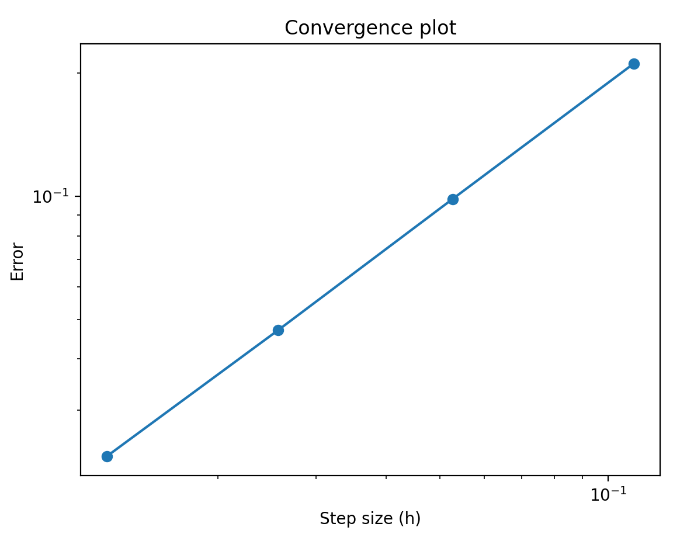
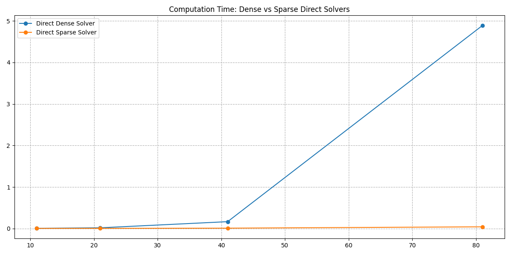
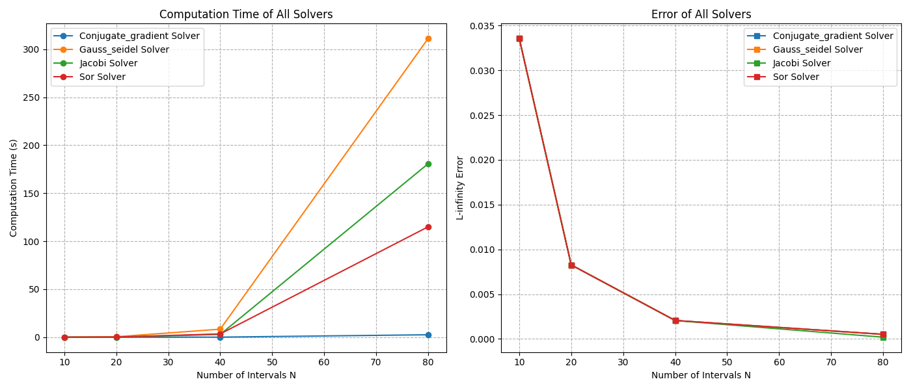
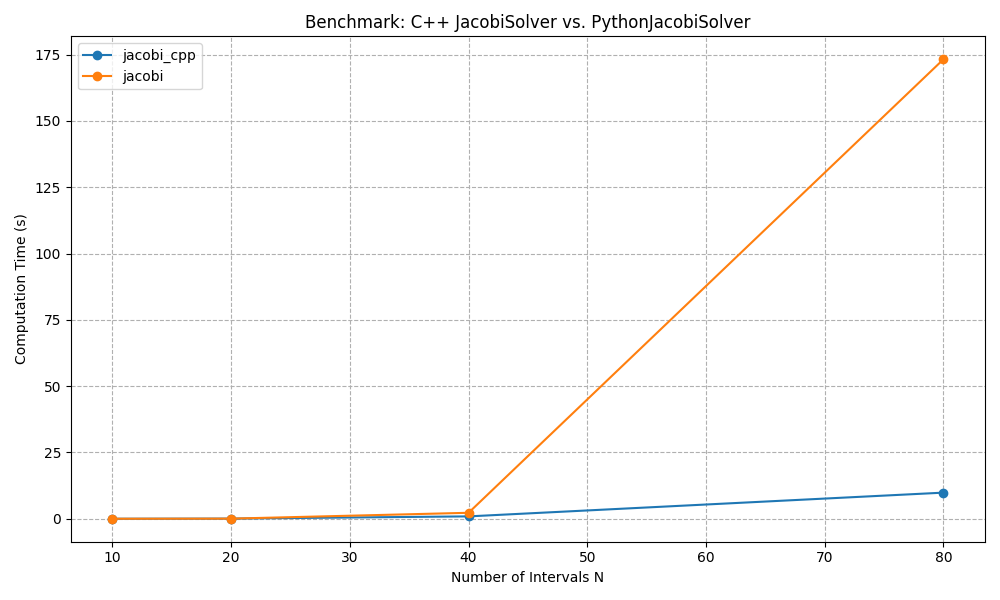

# Solving the 2D Poisson Problem: Detailed Methodologies

## 1. Designing the Solver

### 1.1 Generating the Grid

To solve the 2D Poisson equation numerically, we first discretize the domain using a rectangular grid. Given \( Nx \) and \( Ny \) as the number of intervals in the x and y directions respectively, the total number of grid points including boundaries is \( (Nx+1) \times (Ny+1) \).

1. **Grid Generation**:
- Generate a grid of interior points (excluding boundaries) with dimensions \( (Nx-1) \times (Ny-1) \).
- Each interior point is denoted as \( (x_i, y_j) \) where \( i \in \{1, \ldots, Nx-1\} \) and \( j \in \{1, \ldots, Ny-1\} \).
- Utilize the `numpy.meshgrid` function to create coordinate matrices for these points.

```python
h = 1.0 / (n - 1)
nx = n - 2  # Number of interior points
xi = np.linspace(h, 1 - h, nx)  # Interior points only
yi = np.linspace(h, 1 - h, nx)  # Interior points only
x, y = np.meshgrid(xi, yi)
```

- **Explanation**:
    - **Grid Spacing (`h`)**: Determines the distance between adjacent grid points. By setting \( h = \frac{1}{n-1} \), we ensure a uniform grid over the domain \([0, 1]\).
    - **Interior Points (`nx`)**: We exclude the boundary points to focus on the interior where the Poisson equation is solved. This results in \( nx = n - 2 \) interior points in each direction.
    - **Generating Coordinates (`xi`, `yi`)**: `np.linspace` generates evenly spaced points between \( h \) and \( 1 - h \), ensuring that boundary points at \( 0 \) and \( 1 \) are excluded.
    - **Meshgrid (`x`, `y`)**: `np.meshgrid` creates 2D coordinate matrices from the 1D arrays `xi` and `yi`, facilitating vectorized computations for the grid points.

### 1.2 Finite Difference Approximation

2. **Finite Difference Formula for Second-Order Derivatives**:
- The second-order derivative in 1D can be approximated using central differences:

\[
u''(x) \approx \frac{u_{i+1} - 2u_i + u_{i-1}}{h^2}
\]

- This formula has an approximation order of \( \mathcal{O}(h^2) \).

3. **Discrete Laplacian in 2D**:
- Apply the finite difference formula to both x and y directions.
- Combine the partial derivatives to form the discrete Laplacian:

\[
\Delta u_{i,j} = \frac{u_{i+1,j} - 2u_{i,j} + u_{i-1,j}}{h^2} + \frac{u_{i,j+1} - 2u_{i,j} + u_{i,j-1}}{h^2}
\]

- Simplify with a uniform grid (\( h_x = h_y = h \)):

\[
\Delta u_{i,j} = \frac{u_{i+1,j} + u_{i-1,j} + u_{i,j+1} + u_{i,j-1} - 4u_{i,j}}{h^2}
\]

- Let \( u_{i,j} \) represent the unknowns at grid points.

### 1.3 Matrix Formulation

4. **Matrix Representation of the Discrete Poisson Equation**:
- Arrange the unknowns \( u_{i,j} \) into a global vector \( \mathbf{u} \) using column-wise ordering:

\[
\mathbf{u} = \begin{bmatrix}
u_{1,1} \\
u_{2,1} \\
\vdots \\
u_{Nx-1,1} \\
u_{1,2} \\
\vdots \\
u_{Nx-1, Ny-1}
\end{bmatrix}
\]
which is `flatten` in python.

- The discrete Laplacian operator \( \Delta_h \) can be expressed using the Kronecker product:

\[
\Delta_h = I_y \otimes T_x + T_y \otimes I_x
\]

where:
- \( I_x \) and \( I_y \) are identity matrices of size \( Nx-1 \) and \( Ny-1 \) respectively.
- \( T_x \) and \( T_y \) are tridiagonal matrices representing the second-order finite difference in x and y directions.


```python
def finite_difference(N, h):
    #  [0 − 1 1], [−1 1 0], or [−1 0 1] for the first derivatives
    #  [1 − 2 1] for the second derivatives
    e = np.ones(N)
    D = (np.diag(-2 * e) + np.diag(e[:-1], k=-1) + np.diag(e[:-1], k=1)) 
    D /= h**2
    return D
def discretize_poisson(Nx, Ny, h):
    Dx = finite_difference(Nx - 1, h)
    Dy = finite_difference(Ny - 1, h)
    Ix = np.eye(Nx - 1)
    Iy = np.eye(Ny - 1)
    L = np.kron(Iy, Dx) + np.kron(Dy, Ix)
    return L
```
- **Explanation**:
    - **Finite Difference Matrix (`finite_difference`)**:
        - **Diagonal Entries**: The main diagonal is filled with \(-2/h^2\), representing the central coefficient in the finite difference approximation.
        - **Off-Diagonals**: The subdiagonal and superdiagonal are filled with \(1/h^2\), representing the coefficients for \( u_{i-1,j} \) and \( u_{i+1,j} \) respectively.
        - This creates a tridiagonal matrix \( T \) which models the second-order derivative in one dimension.
    - **Discretizing Poisson Equation (`discretize_poisson`)**:
        - **Kronecker Products**: 
            - \( I_y \otimes T_x \) applies the finite difference operator in the x-direction across all y-indices.
            - \( T_y \otimes I_x \) applies the finite difference operator in the y-direction across all x-indices.
        - **Combining Operators**: The sum \( I_y \otimes T_x + T_y \otimes I_x \) effectively creates the 2D discrete Laplacian operator \( \Delta_h \).
        - **Resulting Matrix (`L`)**: Represents the system matrix \( A \) in the linear system \( A\mathbf{u} = \mathbf{f} \).

    - In a 1D tridiagonal matrix \( T \) of size \( Nx-1 \), the offsets usually refer to:
        - The main diagonal at offset 0,
        - The subdiagonal at offset -1,
        - The superdiagonal at offset +1.
- The linear system becomes:

\[
A\mathbf{u} = \mathbf{f}
\]

where \( A = \Delta_h \) and \( \mathbf{f} = \text{RHS} \).

5. **Incorporating Boundary Conditions**:
- For homogeneous Dirichlet boundary conditions (\( u = 0 \) on \( \partial\Omega \)):

\[
A\mathbf{u} = \mathbf{f} + \mathbf{b}
\]

where \( \mathbf{b} \) accounts for the boundary conditions. Since the boundaries are zero, \( \mathbf{b} \) remains zero. For non-zero boundary conditions, \( \mathbf{b} \) is adjusted accordingly.

```python
class DirichletBoundaryCondition(BoundaryCondition):
    def __init__(self, g=None):
        self.g = g  # g is the boundary condition function

    def apply(self, F, X=None, Y=None):
        """Apply Dirichlet boundary conditions using the provided boundary function g"""
        f_bc = F.copy()
        if self.g is not None and X is not None and Y is not None:
            f_bc[0, :] = self.g(X[0, :], Y[0, :])    # Bottom boundary
            f_bc[-1, :] = self.g(X[-1, :], Y[-1, :])  # Top boundary
            f_bc[:, 0] = self.g(X[:, 0], Y[:, 0])    # Left boundary
            f_bc[:, -1] = self.g(X[:, -1], Y[:, -1])  # Right boundary
        else:
            f_bc[0, :] = 0  # Bottom boundary
            f_bc[-1, :] = 0  # Top boundary
            f_bc[:, 0] = 0  # Left boundary
            f_bc[:, -1] = 0  # Right boundary
        return f_bc
```

- **Explanation**:
    - **Abstract Base Class (`BoundaryCondition`)**:
        - Using an abstract base class allows for defining a common interface for different types of boundary conditions (e.g., Dirichlet, Neumann).
        - This promotes code reusability and flexibility, enabling easy extension for additional boundary conditions in the future.
    - **OOP Approach**:
        - Encapsulates boundary condition logic within classes, making the codebase organized and modular.
        - Facilitates maintenance and scalability, as each boundary condition type can be managed independently.
    - **`DirichletBoundaryCondition` Class**:
        - **Constructor (`__init__`)**: Accepts an optional boundary function `g` which defines non-homogeneous boundary conditions.
        - **`apply` Method**:
            - Copies the existing right-hand side vector `F`.
            - If a boundary function `g` is provided along with grid coordinates `X` and `Y`, it applies the non-homogeneous boundary conditions by evaluating `g` at the boundary points.
            - If no boundary function is provided, it defaults to homogeneous Dirichlet conditions by setting boundary values to zero.
        - **Benefits**:
            - **Flexibility**: Can handle both homogeneous and non-homogeneous Dirichlet boundary conditions based on user input.
            - **Modularity**: Boundary condition application logic is separated from the core solver logic, adhering to the single responsibility principle.

## 1.2 Validation of the Implementation

- **Exact Solution for Validation**:
    - Define an exact solution \( u_{\text{ex}}(x, y) = \sin^2(\pi x) \sin^2(\pi y) \).
    - Compute the corresponding right-hand side \( f(x, y) \):

    \[
    \Delta u = 2\pi^2 [\cos(2\pi x)\sin^2(\pi y) + \cos(2\pi y)\sin^2(\pi x)]
    \]
    
    \[
    f(x, y) = -\Delta u = -2\pi^2 [\cos(2\pi x)\sin^2(\pi y) + \cos(2\pi y)\sin^2(\pi x)]
    \]

- **Consistency with Boundary Conditions**:
    - The exact solution satisfies homogeneous Dirichlet boundary conditions since \( \sin(0) = \sin(\pi) = 0 \).

- **Error Computation and Convergence Plot**:
    - After solving the linear system, compute the relative error using the L-infinity norm:

    \[
    \text{Error} = \max_{i,j} |u_{\text{ex}}(x_i, y_j) - u_{i,j}|
    \]

    - Generate a log-log convergence plot showing error versus step size \( h \).
    - The expected convergence rate is \( \mathcal{O}(h^2) \).

### 1.2.1 Convergence Plot

#### **Task Breakdown:**
1. Set up a computational domain \(\Omega\) with a small number of grid points.
2. Discretize the governing equation (e.g., Poisson's equation) using finite differences or similar numerical methods.
3. Solve the resulting linear system using a solver (e.g., direct methods, iterative solvers like Jacobi or Gauss-Seidel).
4. Compute the relative error in the maximum norm:
   \[
   \text{Relative Error} = \frac{\| u_{\text{computed}} - u_{\text{exact}} \|_\infty}{\| u_{\text{exact}} \|_\infty}.
   \]
5. Plot the convergence on a log-log scale with respect to the step size \(h\).

#### **Expected Convergence Rate:**
For second-order finite difference schemes, the error typically converges at \(\mathcal{O}(h^2)\), where \(h\) is the grid spacing.

#### **Computational Time Considerations:**
- As the number of grid points increases, the size of the system grows.
- Iterative solvers (e.g., Jacobi, Gauss-Seidel) may take more iterations for convergence.
- Direct methods (e.g., Gaussian elimination) scale poorly for large systems due to high computational cost.


#### **Observations:**
- The convergence plot should demonstrate the expected \(\mathcal{O}(h^2)\) behavior.
- Computational time may increase significantly with finer grids.

---


**Figure:** Log-Log Convergence Plot showing error versus step size \( h \). The slope indicates second-order convergence.

## 2. Solving the Linear System

### 2.1 Direct Methods

#### **What is a Sparse Matrix?**
A matrix is sparse if most of its elements are zero. Sparse matrix representation stores only the nonzero elements and their positions, saving memory and computation.
- Utilize `scipy.sparse` to store only non-zero entries, reducing memory usage and computational overhead.
- Represent the discrete Laplacian \( \Delta_h \) as:

\[
\Delta_h = I \otimes T + T \otimes I
\]

where \( T \) is a tridiagonal matrix with \( 2 \) on the diagonal and \( -1 \) on the off-diagonals.

#### **Why Use Sparse Matrices?**
- **Memory Efficiency**: Only non-zero elements are stored, significantly reducing memory for large systems.
   - Example: A tridiagonal matrix of size \(n \times n\) requires only \(3n\) entries instead of \(n^2\).
- **Computational Speed**: Operations like matrix-vector multiplication and solving linear systems are faster due to the reduced number of elements.
   - Sparse matrices allow efficient operations (e.g., matrix-vector multiplication) by avoiding computations with zero elements.
- **Operation Count**:
    - Gaussian elimination on a tridiagonal matrix has \( \mathcal{O}(N) \) operations compared to \( \mathcal{O}(N^3) \) for a dense matrix.

    - **Gaussian Elimination for Tridiagonal Matrix:**
    For a tridiagonal matrix, Gaussian elimination requires:
        1. **Forward Elimination**:
        - Modify the \(n-1\) subdiagonal and diagonal elements.
        - Total operations: \(n-1\) divisions and \(n-1\) multiplications.
        
        2. **Backward Substitution**:
        - Solve for \(x_i\) using the already modified matrix.
        - Total operations: \(n\) multiplications and \(n-1\) additions.

    - **Total Operations for Tridiagonal Matrix:**
        \[
        \mathcal{O}(n)
        \]
        This is much smaller than the \(\mathcal{O}(n^3)\) complexity for a dense \(n \times n\) matrix.

---
```python
diagonals = [
    -1 * np.ones(nx - 1),  # Lower diagonal
    2 * np.ones(nx),  # Main diagonal
    -1 * np.ones(nx - 1)  # Upper diagonal
]
offsets = [-1, 0, 1]

T = sp.diags(diagonals, offsets, shape=(nx, nx),
            format='csr') / (h * h)

# Identity matrix
I = sp.identity(ny, format='csr')

# 2D Laplacian using Kronecker product
A = sp.kron(I, T) + sp.kron(T, I)
# Add alpha * I to the operator
A += self.alpha * sp.eye((self.Nx - 1) * (self.Ny - 1), format='csr')
```

#### **Explanation**:
- **Creating Tridiagonal Matrix (`T`)**:
    - **Diagonal Arrays**:
        - **Lower Diagonal**: \(-1\) for all sub-diagonal entries.
        - **Main Diagonal**: \(2\) for all diagonal entries.
        - **Upper Diagonal**: \(-1\) for all super-diagonal entries.
    - **Offsets**: \([-1, 0, 1]\) correspond to the positions of the lower diagonal, main diagonal, and upper diagonal respectively.
    - **`sp.diags` Function**:
        - Constructs a sparse diagonal matrix from the provided diagonals and their corresponding offsets.
        - The matrix is divided by \( h^2 \) to account for the finite difference scaling.
        - **Sparse Format (`csr`)**: Compressed Sparse Row format allows efficient arithmetic operations and matrix-vector products.
- **Identity Matrix (`I`)**:
    - Creates a sparse identity matrix of size \( Ny \) in CSR format.
- **2D Laplacian (`A`)**:
    - **Kronecker Products (`sp.kron`)**:
        - \( I \otimes T \): Applies the tridiagonal operator \( T \) across all y-indices.
        - \( T \otimes I \): Applies the tridiagonal operator \( T \) across all x-indices.
    - **Summation**: \( A = I \otimes T + T \otimes I \) forms the 2D Laplacian operator by combining x and y directional differences.
- **Adding Diffusion Term**:
    - \( A += \alpha I \): Incorporates the diffusion term \( \alpha u \) into the system matrix, maintaining the symmetric positive definite (SPD) property provided \( \alpha \geq 0 \).




### 2.2 Iterative Methods

#### **Eigenvalue Analysis**:

- For a tridiagonal matrix \( T \) of size \( N \):

\[
\lambda_i = 2 - 2\cos\left(\frac{\pi i}{N+1}\right), \quad i = 1, 2, \ldots, N
\]
##### Problem 1: Eigenvalues of \( T \) (1D Discrete Laplacian)

###### **Matrix Definition**:
The 1D discrete Laplacian matrix \( T \) of size \( N \) is defined as a tridiagonal matrix with:
\[
T = 
\begin{bmatrix}
2 & -1 & 0 & \cdots & 0 \\
-1 & 2 & -1 & \cdots & 0 \\
0 & -1 & 2 & \cdots & 0 \\
\vdots & \vdots & \vdots & \ddots & -1 \\
0 & 0 & 0 & -1 & 2
\end{bmatrix}.
\]

###### **Recurrence Formula and Connection to Chebyshev Polynomials**:
1. The eigenvalue problem for \( T \) can be written as:
   \[
   T \mathbf{v} = \lambda \mathbf{v},
   \]
   where \( \mathbf{v} \) is the eigenvector.
   
2. Substituting \( T \) into the eigenvalue equation gives a recurrence relation for the components \( v_i \) of \( \mathbf{v} \):
   \[
   -v_{i-1} + 2v_i - v_{i+1} = \lambda v_i, \quad i = 1, 2, \dots, N.
   \]

3. Assume \( v_i = \sin(k i) \). Substituting into the recurrence relation yields:
   \[
   -\sin(k(i-1)) + 2\sin(ki) - \sin(k(i+1)) = \lambda \sin(ki).
   \]

4. Using the trigonometric identity:
   \[
   \sin(k(i+1)) + \sin(k(i-1)) = 2 \cos(k) \sin(ki),
   \]
   this simplifies to:
   \[
   2(1 - \cos(k)) \sin(ki) = \lambda \sin(ki).
   \]

5. Therefore, the eigenvalues are:
   \[
   \lambda = 2(1 - \cos(k)).
   \]

6. Choosing \( k = \frac{\pi i}{N+1} \) (as boundary conditions imply discrete wavenumbers), the eigenvalues are:
   \[
   \lambda_i = 2 - 2\cos\left(\frac{\pi i}{N+1}\right), \quad i = 1, 2, \dots, N.
   \]

###### **Relation to Chebyshev Polynomials**:
The recurrence relation resembles the recurrence defining Chebyshev polynomials \( T_n(x) \):
\[
T_{n+1}(x) = 2xT_n(x) - T_{n-1}(x),
\]
where \( T_n(\cos(\theta)) = \cos(n\theta) \). This explains the connection between the eigenvalues and the cosine function.

---

##### Problem 2: Eigenvalues of the 2D Discrete Laplacian

#### **Matrix Definition**:
The 2D discrete Laplacian matrix \( \Delta_h \) for a grid of size \( N \times N \) can be written using the Kronecker product as:
\[
\Delta_h = I_N \otimes T + T \otimes I_N,
\]
where:
- \( I_N \) is the \( N \times N \) identity matrix,
- \( T \) is the 1D discrete Laplacian matrix.

###### **Kronecker Product and Eigenvalues**:
The key property of the Kronecker product is that the eigenvalues of \( A \otimes B \) are the products of the eigenvalues of \( A \) and \( B \). For the sum \( \Delta_h \), the eigenvalues are sums of eigenvalues of \( I_N \otimes T \) and \( T \otimes I_N \).

1. Eigenvalues of \( I_N \) are all 1.
2. Eigenvalues of \( T \) are \( \lambda_i = 2 - 2\cos\left(\frac{\pi i}{N+1}\right) \).

For \( \Delta_h \), the eigenvalues are:
\[
\lambda_{i,j} = \lambda_i + \lambda_j,
\]
where \( \lambda_i = 2 - 2\cos\left(\frac{\pi i}{N+1}\right) \) and \( \lambda_j = 2 - 2\cos\left(\frac{\pi j}{N+1}\right) \), for \( i, j = 1, 2, \dots, N \).

###### **Final Expression for 2D Eigenvalues**:
\[
\lambda_{i,j} = 4 - 2\cos\left(\frac{\pi i}{N+1}\right) - 2\cos\left(\frac{\pi j}{N+1}\right).
\]

This result reflects the summation of contributions from the \( x \)- and \( y \)-directions of the discrete Laplacian.

---

##### Summary
1. The eigenvalues of the 1D Laplacian matrix \( T \) are \( \lambda_i = 2 - 2\cos\left(\frac{\pi i}{N+1}\right) \).
2. For the 2D Laplacian using the Kronecker product form, the eigenvalues are:
   \[
   \lambda_{i,j} = 4 - 2\cos\left(\frac{\pi i}{N+1}\right) - 2\cos\left(\frac{\pi j}{N+1}\right).
   \]

#### **Implementation of Iterative Methods**:
##### **Jacobi Method**:
The **Jacobi Method** is an iterative algorithm for solving a system of linear equations \( Ax = b \), where \( A \) is a square matrix. The method splits \( A \) into its diagonal component \( D \), and the remainder \( R = A - D \). The iteration formula is:
\[
x^{(k+1)} = D^{-1}(b - Rx^{(k)})
\]
This updates all variables \( x_i \) simultaneously using values from the previous iteration.

###### **Steps**:
1. Decompose \( A \) into \( D \) (diagonal) and \( R \) (remainder).
2. Use the formula \( x^{(k+1)}_i = \frac{1}{A_{ii}} \left(b_i - \sum_{j \neq i} A_{ij} x^{(k)}_j \right) \) for each \( i \).
3. Iterate until the solution converges.

###### **Pseudo Code**:
```plaintext
Input: A (nxn matrix), b (n-dimensional vector), tol (tolerance), max_iter (maximum iterations)
Output: x (solution vector)

Initialize x^(0) = [0, 0, ..., 0]  (or another guess)
for k = 1 to max_iter:
    x_new = x^(k)
    for i = 1 to n:
        sum = 0
        for j = 1 to n:
            if i != j:
                sum += A[i][j] * x[j]
        x_new[i] = (b[i] - sum) / A[i][i]
    if ||x_new - x||_inf < tol:
        return x_new
    x = x_new
return x
```

---

```python
class JacobiSolver(IterativeSolver):
    def solve(self, L, b):
        logging.info("JacobiSolver: Solving system")
        if sp.issparse(L):
            L = L.toarray()
        logging.debug(f"L: {L.shape}, {sp.issparse(L)}")
        
        D = np.diag(L)
        R = L - np.diagflat(D)
        x = np.zeros_like(b, dtype=float)

        for i in range(self.max_iter):
            x_new = (b - np.dot(R, x)) / D
            if np.linalg.norm(x_new - x, ord=np.inf) < self.tol:
                self.iterations = i + 1
                return x_new
            x = x_new
        else:
            self.iterations = self.max_iter

        return x
```

###### **Explanation**:
- **Initialization**:
    - **Diagonal Matrix (`D`)**: Extracts the diagonal elements of \( L \) which correspond to \( A_{ii} \).
    - **Residual Matrix (`R`)**: Represents \( L \) with the diagonal removed, used to compute the residual \( b - R x \).
    - **Initial Guess (`x`)**: Starts with a zero vector.
- **Iterative Update**:
    - **Compute New \( x \)**: Updates each component of \( x \) based on the previous iteration values.
    - **Convergence Check**: Uses the infinity norm to determine if the solution has converged within the specified tolerance.
    - **Iteration Count**: Tracks the number of iterations taken to converge.
- **Termination**:
    - Returns the updated solution if convergence is achieved.
    - If the maximum number of iterations is reached without convergence, returns the last computed solution.


##### **Gauss-Seidel Method**:
The **Gauss-Seidel Method** is similar to the Jacobi Method but uses updated values as soon as they are computed. This usually leads to faster convergence.

###### **Steps**:
1. Decompose \( A \) into \( D + L \) (diagonal and lower triangular parts) and \( U \) (upper triangular part).
2. Use the formula \( x^{(k+1)}_i = \frac{1}{A_{ii}} \left(b_i - \sum_{j < i} A_{ij} x^{(k+1)}_j - \sum_{j > i} A_{ij} x^{(k)}_j \right) \).
3. Iterate until convergence.

###### **Pseudo Code**:
```plaintext
Input: A (nxn matrix), b (n-dimensional vector), tol (tolerance), max_iter (maximum iterations)
Output: x (solution vector)

Initialize x^(0) = [0, 0, ..., 0]  (or another guess)
for k = 1 to max_iter:
    x_new = x^(k)
    for i = 1 to n:
        sum1 = sum(A[i][j] * x_new[j] for j in range(1, i))  # Updated values
        sum2 = sum(A[i][j] * x[j] for j in range(i+1, n))   # Old values
        x_new[i] = (b[i] - sum1 - sum2) / A[i][i]
    if ||x_new - x||_inf < tol:
        return x_new
    x = x_new
return x
```

---


```python
class GaussSeidelSolver(IterativeSolver):
    def solve(self, L, b):
        logging.info("GaussSeidelSolver: Solving system")
        if sp.issparse(L):
            L = L.toarray()

        n = len(b)
        x = np.zeros_like(b, dtype=float)
        D = np.diag(L)
        M = L - np.diagflat(D)

        for j in range(self.max_iter):
            x_new = x.copy()
            for i in range(n):
                sigma = np.dot(M[i, :], x_new)
                x_new[i] = (b[i] - sigma) / D[i]
            if np.linalg.norm(x_new - x, ord=np.inf) < self.tol:
                self.iterations = j + 1
                return x_new
            x = x_new
        else:
            self.iterations = self.max_iter
        return x
```

###### **Explanation**:
- **Initialization**:
    - **Diagonal Matrix (`D`)**: Extracts the diagonal elements of \( L \) corresponding to \( A_{ii} \).
    - **Residual Matrix (`M`)**: Represents \( L \) with the diagonal removed.
    - **Initial Guess (`x`)**: Starts with a zero vector.
- **Iterative Update**:
    - **Row-wise Update**: Iterates through each component of \( x \), updating it based on the latest available values.
    - **Residual Calculation (`sigma`)**: Computes the sum of \( A_{ij} x_j \) for \( j \neq i \).
    - **Update Rule**: Updates \( x_i \) using the residual and the current diagonal element.
    - **Convergence Check**: Uses the infinity norm to determine if the solution has converged within the specified tolerance.
    - **Iteration Count**: Tracks the number of iterations taken to converge.
- **Termination**:
    - Returns the updated solution if convergence is achieved.
    - If the maximum number of iterations is reached without convergence, returns the last computed solution.


##### **Successive Over-Relaxation (SOR) Method**:
The **SOR Method** is a modified Gauss-Seidel Method that introduces a relaxation factor \( \omega \) to accelerate convergence. The update formula is:
\[
x_i^{(k+1)} = (1 - \omega)x_i^{(k)} + \frac{\omega}{A_{ii}} \left(b_i - \sum_{j < i} A_{ij} x_j^{(k+1)} - \sum_{j > i} A_{ij} x_j^{(k)} \right)
\]
- For \( \omega = 1 \), it reduces to Gauss-Seidel.
- \( \omega > 1 \) accelerates convergence (over-relaxation).
- \( 0 < \omega < 1 \) slows convergence (under-relaxation).

###### **Pseudo Code**:
```plaintext
Input: A (nxn matrix), b (n-dimensional vector), tol (tolerance), max_iter (maximum iterations), omega (relaxation factor)
Output: x (solution vector)

Initialize x^(0) = [0, 0, ..., 0]  (or another guess)
for k = 1 to max_iter:
    x_new = x^(k)
    for i = 1 to n:
        sum1 = sum(A[i][j] * x_new[j] for j in range(1, i))  # Updated values
        sum2 = sum(A[i][j] * x[j] for j in range(i+1, n))   # Old values
        x_new[i] = (1 - omega) * x[i] + omega * (b[i] - sum1 - sum2) / A[i][i]
    if ||x_new - x||_inf < tol:
        return x_new
    x = x_new
return x
```

---

```python
class SORSolver(IterativeSolver):
def __init__(self, omega=1.5, tol=1e-8, max_iter=1000):
    super().__init__(tol, max_iter)
    self.omega = omega

def solve(self, L, b):
    logging.info("SORSolver: Solving system")
    if sp.issparse(L):
        L = L.toarray()

    n = len(b)
    x = np.zeros_like(b, dtype=float)
    D = np.diag(L)
    M = L - np.diagflat(D)

    for j in range(self.max_iter):
        x_new = x.copy()
        for i in range(n):
            sigma = np.dot(M[i, :], x_new)
            x_new[i] = (1 - self.omega) * x[i] + (self.omega / D[i]) * (b[i] - sigma)
        if np.linalg.norm(x_new - x, ord=np.inf) < self.tol:
            self.iterations = j + 1
            return x_new
        x = x_new

    else:
        self.iterations = self.max_iter
    return x
```

###### **Explanation**:
- **Initialization**:
    - **Relaxation Factor (`omega`)**: Determines the influence of the new update on the existing solution. Values between 1 and 2 can accelerate convergence.
    - **Diagonal Matrix (`D`)**: Extracts the diagonal elements of \( L \) corresponding to \( A_{ii} \).
    - **Residual Matrix (`M`)**: Represents \( L \) with the diagonal removed.
    - **Initial Guess (`x`)**: Starts with a zero vector.
- **Iterative Update**:
    - **Row-wise Update with Relaxation**: Iterates through each component of \( x \), updating it based on the residual and the relaxation factor.
    - **Residual Calculation (`sigma`)**: Computes the sum of \( A_{ij} x_j \) for \( j \neq i \).
    - **Update Rule**: Combines the old value and the new computed value using the relaxation factor \( \omega \).
    - **Convergence Check**: Uses the infinity norm to determine if the solution has converged within the specified tolerance.
    - **Iteration Count**: Tracks the number of iterations taken to converge.
- **Termination**:
    - Returns the updated solution if convergence is achieved.
    - If the maximum number of iterations is reached without convergence, returns the last computed solution.

#### **Convergence of Iterative Methods for the Discrete Poisson Problem**

##### **Convergence Analysis**:

The convergence of iterative methods depends on the spectral properties of the matrix \( A \), which is the system matrix derived from the discrete Poisson equation. This matrix is symmetric, positive-definite, and sparse. 

1. **Convergence Condition**:
   - The convergence of iterative solvers like Jacobi, Gauss-Seidel, and SOR is determined by the spectral radius \( \rho(B) \) of the iteration matrix \( B \). The method converges if \( \rho(B) < 1 \).
   
2. **Iteration Matrices**:
   - For Jacobi, \( B = D^{-1}(L + U) \), where \( D \), \( L \), and \( U \) are the diagonal, strictly lower triangular, and strictly upper triangular parts of \( A \).
   - For Gauss-Seidel, \( B = (D + L)^{-1}U \).
   - For SOR, \( B = (D + \omega L)^{-1}((1 - \omega)D - \omega U) \).

3. **Convergence Radius**:
   - The convergence rate of iterative solvers is governed by \( \rho(B) \), the spectral radius of the iteration matrix \( B \). The closer \( \rho(B) \) is to 0, the faster the convergence.

##### **Impact of Grid Points**:
As the number of grid points increases:
1. The condition number of \( A \) grows, making the system harder to solve iteratively.
2. For a uniform grid with step size \( h \), the condition number of \( A \) scales as \( O(h^{2}) \), which means finer grids (smaller \( h \)) lead to slower convergence.

---

##### **Measuring the Cost of an Iterative Solver**

1. **Number of Iterations**:
   - The number of iterations required to reduce the residual \( \|r_k\| \) below a given threshold \( \varepsilon \) measures the solver's efficiency.

2. **Cost per Iteration**:
   - The cost per iteration is primarily the number of floating-point operations (FLOPs) needed to perform matrix-vector multiplications or updates, typically proportional to the number of non-zero entries in \( A \). For sparse matrices, this is \( O(N) \) for \( N \) grid points.

3. **Total Cost**:
   - Total cost = \( (\text{Number of Iterations}) \times (\text{Cost per Iteration}) \).

---


##### **Analysis of Optimal Relaxation Parameter**

1. **Optimal \( \omega \)**:
   - Theoretical analysis suggests the optimal relaxation parameter for SOR lies between \( 1 < \omega < 2 \).
   - For \( A \) derived from the Poisson equation, an approximate formula for the optimal \( \omega \) is:
     \[
     \omega_{\text{opt}} = \frac{2}{1 + \sqrt{1 - \rho(B_{\text{Gauss-Seidel}})^2}},
     \]
     where \( \rho(B_{\text{Gauss-Seidel}}) \) is the spectral radius of the Gauss-Seidel iteration matrix.

2. **Observation**:
   - Plotting the number of iterations versus \( \omega \) shows a clear minimum at an optimal \( \omega \), validating the theoretical prediction.

---

##### **Residual Comparison for Different Methods**

```python
methods = ['Jacobi', 'Gauss-Seidel', 'SOR']
residuals = {method: [] for method in methods}
iterations = 100

for method in methods:
    x = np.zeros(N)
    for k in range(iterations):
        if method == 'Jacobi':
            x = jacobi_method(A, b, x, tol)
        elif method == 'Gauss-Seidel':
            x = gauss_seidel(A, b, x, tol)
        elif method == 'SOR':
            x, _ = sor_method(A, b, x, omega=1.5, tol)
        residual = np.linalg.norm(b - A @ x)
        residuals[method].append(residual)

# Plot residuals
plt.figure(figsize=(8, 6))
for method, res in residuals.items():
    plt.plot(range(iterations), res, label=method)
plt.xlabel('Iteration')
plt.ylabel('Residual')
plt.title('Residuals for Different Methods')
plt.legend()
plt.grid()
plt.show()
```




| Solver 	| N 	| error 	| time 	| iterations 	|
|---	|---	|---	|---	|---	|
| jacobi 	| 10 	| 3.355821e-02 	| 0.010227 	| 303 	|
| jacobi 	| 20 	| 8.264622e-03 	| 0.039889 	| 1108 	|
| jacobi 	| 40 	| 2.055482e-03 	| 2.118783 	| 3990 	|
| jacobi 	| 80 	| 1.918587e-04 	| 195.398791 	| 10000 	|
| gauss_seidel 	| 10 	| 3.355830e-02 	| 0.040320 	| 159 	|
| gauss_seidel 	| 20 	| 8.265027e-03 	| 0.453880 	| 583 	|
| gauss_seidel 	| 40 	| 2.057099e-03 	| 9.131069 	| 2108 	|
| gauss_seidel 	| 80 	| 5.077302e-04 	| 397.333557 	| 7534 	|
| sor 	| 10 	| 3.355838e-02 	| 0.011639 	| 44 	|
| sor 	| 20 	| 8.265308e-03 	| 0.185665 	| 201 	|
| sor 	| 40 	| 2.058190e-03 	| 4.267132 	| 755 	|
| sor 	| 80 	| 5.120652e-04 	| 155.291985 	| 2743 	|
| conjugate_gradient 	| 10 	| 3.355839e-02 	| 0.006409 	| 13 	|
| conjugate_gradient 	| 20 	| 8.265417e-03 	| 0.008871 	| 38 	|
| conjugate_gradient 	| 40 	| 2.058707e-03 	| 0.087864 	| 80 	|
| conjugate_gradient 	| 80 	| 5.142005e-04 	| 4.240111 	| 163 	|
| lu 	| 10 	| 3.355839e-02 	| 0.031273 	| 0 	|
| lu 	| 20 	| 8.265417e-03 	| 0.009369 	| 0 	|
| lu 	| 40 	| 2.058707e-03 	| 0.011121 	| 0 	|
| lu 	| 80 	| 5.142005e-04 	| 0.037414 	| 0 	|
| cholesky 	| 10 	| 3.355839e-02 	| 0.016938 	| 0 	|
| cholesky 	| 20 	| 8.265417e-03 	| 0.025680 	| 0 	|
| cholesky 	| 40 	| 2.058707e-03 	| 0.406667 	| 0 	|
| cholesky 	| 80 	| 5.142005e-04 	| 26.478723 	| 0 	|
| low_rank 	| 10 	| 1.000022e+00 	| 0.040507 	| 0 	|
| low_rank 	| 20 	| 1.000000e+00 	| 0.021198 	| 0 	|
| low_rank 	| 40 	| 1.000000e+00 	| 0.075826 	| 0 	|
| low_rank 	| 80 	| 1.000000e+00 	| 0.512339 	| 0 	|
---

##### **Conclusion on Performance**:
- **SOR** converges faster with a properly chosen \( \omega \) compared to Jacobi and Gauss-Seidel.
- **Jacobi** is slowest due to weaker coupling between variables.
- **Gauss-Seidel** is faster than Jacobi due to sequential updates.
- **Computational Time**: SOR achieves better convergence but requires careful tuning of \( \omega \).


### OOP with **Factory Pattern and Singleton Pattern**

#### **Factory Pattern**
- **Definition**: The Factory Pattern is a creational design pattern that provides an interface for creating objects in a super-class, but allows subclasses to alter the type of objects that will be created.
- **Why Use It**:
  - **Encapsulation**: Hides the object creation logic from the client.
  - **Flexibility**: Makes it easier to introduce new types of objects without modifying existing code.
  - **Abstraction**: Reduces dependencies between classes.

#### **Singleton Pattern**
- **Definition**: The Singleton Pattern ensures that a class has only one instance and provides a global point of access to it.
- **Why Use It**:
  - **Resource Management**: Useful when exactly one object is needed to coordinate actions (e.g., a configuration manager or logging system).
  - **Global Access**: Provides a single instance that can be accessed across the application.

#### **Comparison**:
| **Aspect**       | **Factory Pattern**                          | **Singleton Pattern**                     |
|-------------------|---------------------------------------------|------------------------------------------|
| **Purpose**       | Creates multiple objects with varying types | Ensures only one instance of a class     |
| **Use Case**      | Object creation with flexibility            | Global state or resource management      |

---

#### **`staticmethod`**
- **Definition**: A `staticmethod` is a method that belongs to a class but does not require an instance or access to the instance’s attributes or methods.
- **Why Use It**:
  - **Utility Functions**: Encapsulate logic that pertains to the class but does not depend on any specific instance (e.g., helper or factory methods).
  - **Namespace Clarity**: Keeps related functionality organized within the class while avoiding the need to instantiate the class.

---

```python
class SolverFactory(metaclass=SingletonMeta):

    @staticmethod
    def create_solver(solver_type,
                    tol=1e-8,
                    max_iter=2000,
                    **kwargs):  
        if solver_type == "direct":
            return DirectSolver()
        elif solver_type == "fst":
            return FastPoissonSolver()
        elif solver_type == "lu":
            return LUdecompositionSolver()
        elif solver_type == "cholesky":
            return CholeskySolver()
        elif solver_type == "low_rank":
            return LowRankApproximationSolver()
        elif solver_type == "jacobi":
            return JacobiSolver(tol=tol, max_iter=max_iter, **kwargs)
        elif solver_type == "conjugate_gradient":
            return ConjugateGradientSolver(tol=tol, max_iter=max_iter, **kwargs)
        elif solver_type == "graph":
            return GraphSolver()
        elif solver_type == "priority_queue":
            return PriorityQueueSolver(tol=tol, max_iter=max_iter, **kwargs)
        elif solver_type == "gauss_seidel":
            return GaussSeidelSolver(tol=tol, max_iter=max_iter, **kwargs)
        elif solver_type == "sor":
            omega = kwargs.get('omega', 1.5)
            return SORSolver(omega=omega, tol=tol, max_iter=max_iter, **kwargs)
        elif solver_type == "jacobi_cpp":
            return CppJacobiSolver(**kwargs)  # Existing C++ solver
        else:
            raise ValueError(f"Unknown solver type: {solver_type}")
```


## 3. Extensions to the Solver

### 3.1 Adding a Diffusion Term

The modified equation is:
\[
\Delta u + \alpha u = f,
\]
where \( \alpha \) is a real parameter. This introduces a **reaction term** into the equation.

#### **Effect of \( \alpha < 0 \) on Iterative Methods**:

When solving partial differential equations (PDEs) like \( -\Delta u + \alpha u = f \), the **discretization** of the domain (e.g., using finite difference or finite element methods) transforms the continuous problem into a finite-dimensional approximation. 

- \( -\Delta u \) (the Laplacian term) is approximated using numerical schemes (e.g., second-order central difference).
- The function \( u \) at grid points becomes a vector \( \mathbf{u} \).
- The right-hand side \( f \) becomes a vector \( \mathbf{f} \).
- The discretized Laplacian leads to a system matrix \( A_{\Delta} \).
- The term \( \alpha u \) introduces a diagonal term to the system matrix.
- The resulting linear system is:
\[
A \mathbf{u} = \mathbf{f},
\]
where \( A = A_{\Delta} + \alpha I.\) is the system matrix combining the discretized Laplacian and the effect of \( \alpha \).

---

- **Eigenvalue Analysis**:
  - The eigenvalues of \( A_{\Delta} \) are non-negative and denoted \( \lambda_i \).
  - The eigenvalues of \( A \) are \( \mu_i = \lambda_i + \alpha \).
  - If \( \alpha < 0 \), the eigenvalues \( \mu_i \) can become negative, leading to a **non-positive definite matrix**.
  - Iterative methods like Jacobi, Gauss-Seidel, and SOR rely on \( A \) being positive definite for convergence, so these methods may fail or converge very slowly when \( \alpha < 0 \).

#### **Solution Approach**:
1. **Direct Solvers**:
   - Methods like LU decomposition or Cholesky can handle the problem but may require pivoting if \( A \) is no longer positive definite.
2. **Iterative Solvers**:
   - Conjugate Gradient requires positive definiteness, so it fails for \( \alpha < 0 \).

---

### 3.2 Implementing Higher-Order Finite Difference Schemes

The standard second-order centered difference for the Laplacian in 1D is:
\[
\frac{u_{i-1} - 2u_i + u_{i+1}}{h^2}.
\]

A fourth-order accurate formula is:
\[
\frac{-u_{i-2} + 16u_{i-1} - 30u_i + 16u_{i+1} - u_{i+2}}{12h^2}.
\]

To get a higher-order accurate approximation, we can use more points to construct a better formula. The general idea is to form a weighted combination of \( u_{i-2}, u_{i-1}, u_i, u_{i+1}, u_{i+2} \) such that the approximation becomes more accurate (i.e., the truncation error is reduced).

We start by using the **Taylor series expansion** to expand \( u_{i-2}, u_{i-1}, u_{i+1}, u_{i+2} \) around the point \( i \). For example:

\[
u_{i+1} = u_i + h u'_i + \frac{h^2}{2} u''_i + \frac{h^3}{6} u'''_i + \frac{h^4}{24} u^{(4)}_i + \mathcal{O}(h^5),
\]

\[
u_{i-1} = u_i - h u'_i + \frac{h^2}{2} u''_i - \frac{h^3}{6} u'''_i + \frac{h^4}{24} u^{(4)}_i + \mathcal{O}(h^5),
\]

\[
u_{i+2} = u_i + 2h u'_i + 2h^2 u''_i + \frac{8h^3}{6} u'''_i + \frac{16h^4}{24} u^{(4)}_i + \mathcal{O}(h^5),
\]

\[
u_{i-2} = u_i - 2h u'_i + 2h^2 u''_i - \frac{8h^3}{6} u'''_i + \frac{16h^4}{24} u^{(4)}_i + \mathcal{O}(h^5).
\]

Now, we aim to combine these approximations with coefficients that eliminate the odd-order terms (like \( u'_i \), \( u'''_i \)) and optimize the coefficients for the even-order terms (like \( u_i \), \( u''_i \)) to achieve fourth-order accuracy.

By using the Taylor expansions above, we aim to construct a linear combination of \( u_{i-2}, u_{i-1}, u_i, u_{i+1}, u_{i+2} \) that eliminates the odd-order terms, and leads to a second derivative approximation with fourth-order accuracy. We set the following weighted sum:

\[
\frac{-u_{i-2} + 16u_{i-1} - 30u_i + 16u_{i+1} - u_{i+2}}{12h^2}.
\]


We verify the accuracy by expanding the terms using the Taylor series for each of \( u_{i-2}, u_{i-1}, u_i, u_{i+1}, u_{i+2} \) and ensuring that the terms involving \( u'_i \), \( u'''_i \), and higher derivatives cancel out. In the end, the error is of the order \( \mathcal{O}(h^4) \), indicating that the formula is indeed fourth-order accurate.

---
#### **Implementation**:
```python
import numpy as np

def laplacian_4th_order(u, h):
    """
    Compute the fourth-order finite difference approximation of the Laplacian.
    """
    n = len(u)
    lap = np.zeros(n)
    for i in range(2, n - 2):
        lap[i] = (-u[i - 2] + 16 * u[i - 1] - 30 * u[i] + 16 * u[i + 1] - u[i + 2]) / (12 * h**2)
    return lap
```

---

### 3.3 Implementing the Conjugate Gradient Iterative Method


- **Conjugate Gradient Method**:
The **Conjugate Gradient Method** is an iterative solver for symmetric positive-definite systems. It minimizes the quadratic form associated with \( Ax = b \) in the Krylov subspace.

#### **Steps**:
1. Initialize \( x^{(0)} = 0 \), compute \( r^{(0)} = b - Ax^{(0)} \), and set \( p^{(0)} = r^{(0)} \).
2. For \( k = 0, 1, 2, \ldots \):
   - Compute \( \alpha_k = \frac{r_k^T r_k}{p_k^T A p_k} \).
   - Update \( x^{(k+1)} = x^{(k)} + \alpha_k p^{(k)} \).
   - Compute \( r^{(k+1)} = r^{(k)} - \alpha_k A p^{(k)} \).
   - Check convergence \( ||r^{(k+1)}|| < \text{tol} \).
   - Compute \( \beta_k = \frac{r_{k+1}^T r_{k+1}}{r_k^T r_k} \).
   - Update \( p^{(k+1)} = r^{(k+1)} + \beta_k p^{(k)} \).

#### **Pseudo Code**:
```plaintext
Input: A (nxn SPD matrix), b (n-dimensional vector), tol (tolerance), max_iter (maximum iterations)
Output: x (solution vector)

x = [0, 0, ..., 0]  # Initial guess
r = b - A @ x       # Residual
p = r
rs_old = r.T @ r

for k = 1 to max_iter:
    Ap = A @ p
    alpha = rs_old / (p.T @ Ap)
    x = x + alpha * p
    r = r - alpha * Ap
    rs_new = r.T @ r
    if sqrt(rs_new) < tol:
        break
    beta = rs_new / rs_old
    p = r + beta * p
    rs_old = rs_new

return x
```

---

```python
class ConjugateGradientSolver(IterativeSolver):
    def solve(self, L, b):
        if sp.issparse(L):
            L = L.toarray()

        x = np.zeros_like(b, dtype=float)
        r = b - L.dot(x)
        p = r.copy()
        rsold = np.dot(r, r)

        for i in range(self.max_iter):
            Ap = L.dot(p)
            alpha = rsold / np.dot(p, Ap)  # Now both are scalars
            x += alpha * p
            r -= alpha * Ap
            rsnew = np.dot(r, r)
            if np.sqrt(rsnew) < self.tol:
                self.iterations = i + 1
                return x
            p = r + (rsnew / rsold) * p
            rsold = rsnew

        else:
            self.iterations = self.max_iter
        return x
```

###### **Explanation**:
- **Initialization**:
    - **Initial Guess (`x`)**: Starts with a zero vector.
    - **Residual (`r`)**: Initialized as \( b - L x \), representing the initial error.
    - **Search Direction (`p`)**: Starts as the residual \( r_0 \).
    - **Residual Norm (`rsold`)**: Stores \( r_0^T r_0 \) for computing coefficients.
- **Iterative Update**:
    - **Compute \( Ap \)**: Matrix-vector product \( A p_k \).
    - **Compute Step Size (`alpha`)**: Determines how far to move along the search direction.
    - **Update Solution (`x`)**: Moves to the new point \( x_{k+1} \).
    - **Update Residual (`r`)**: Computes the new residual \( r_{k+1} \).
    - **Check for Convergence**: If the residual norm is below the tolerance, the method has converged.
    - **Compute New Search Direction (`p`)**: Combines the new residual with the previous search direction to form a conjugate direction.
    - **Update Residual Norm (`rsold`)**: Prepares for the next iteration.
- **Termination**:
    - Returns the updated solution if convergence is achieved.
    - If the maximum number of iterations is reached without convergence, returns the last computed solution.


#### Summary of Methods
| **Method**            | **Convergence Speed**      | **Advantages**                         | **Disadvantages**                   |
|------------------------|----------------------------|-----------------------------------------|-------------------------------------|
| **Jacobi**             | Slow                      | Easy to implement                      | Requires more iterations            |
| **Gauss-Seidel**       | Faster than Jacobi        | Faster convergence than Jacobi         | Still slow for large systems        |
| **SOR**                | Adjustable with \( \omega \) | Can accelerate convergence            | Requires optimal \( \omega \)       |
| **Conjugate Gradient** | Fastest for SPD matrices  | Best for large sparse SPD systems      | Limited to SPD matrices             |
---

### 3.4 Implementing Non-Homogeneous Boundary Conditions

- **Definition**: Boundary conditions in partial differential equations (PDEs) where the values on the boundary are not zero. These are in contrast to homogeneous boundary conditions, where the boundary values are set to zero.
- **Dirichlet Boundary Conditions**:
  Directly set boundary values \( u = g(x) \) at the edges.
  
- **Neumann Boundary Conditions**:
  Use ghost points and finite differences to approximate derivatives:
  \[
  \frac{u_{1} - u_{0}}{h} = g \quad \text{or} \quad \frac{u_{N} - u_{N-1}}{h} = g.
  \]


#### **Validation**:
1. Choose an exact solution \( u_{\text{exact}}(x) \).
2. Compute \( f \) using the modified PDE.
3. Solve the system and compare numerical results with \( u_{\text{exact}}(x) \).
4. Check convergence rate \( O(h^2) \) using log-log plots.

---

```python
class DirichletBoundaryCondition(BoundaryCondition):
    def __init__(self, g=None):
        self.g = g  # g is the boundary condition function

    def apply(self, F, X=None, Y=None):
        """Apply Dirichlet boundary conditions using the provided boundary function g"""
        f_bc = F.copy()
        if self.g is not None and X is not None and Y is not None:
            f_bc[0, :] = self.g(X[0, :], Y[0, :])    # Bottom boundary
            f_bc[-1, :] = self.g(X[-1, :], Y[-1, :])  # Top boundary
            f_bc[:, 0] = self.g(X[:, 0], Y[:, 0])    # Left boundary
            f_bc[:, -1] = self.g(X[:, -1], Y[:, -1])  # Right boundary
        else:
            f_bc[0, :] = 0  # Bottom boundary
            f_bc[-1, :] = 0  # Top boundary
            f_bc[:, 0] = 0  # Left boundary
            f_bc[:, -1] = 0  # Right boundary
        return f_bc


class NeumannBoundaryCondition(BoundaryCondition):
    def __init__(self, boundary_value=0, h=1.0):
        self.boundary_value = boundary_value  # Derivative value at the boundary
        self.h = h  # Grid spacing

    def apply(self, F, X=None, Y=None):
        """Apply Neumann boundary conditions using the finite difference approximation for the derivative"""
        f_bc = F.copy()
        if X is not None and Y is not None:
            # Apply Neumann boundary condition using finite difference approximation
            # Bottom boundary (y=0): forward difference approximation for u'(0)
            f_bc[0, :] = f_bc[1, :] + self.boundary_value * self.h  # Bottom boundary
            # Top boundary (y=N-1): backward difference approximation for u'(N-1)
            f_bc[-1, :] = f_bc[-2, :] - self.boundary_value * self.h  # Top boundary
            # Left boundary (x=0): forward difference approximation for u'(0)
            f_bc[:, 0] = f_bc[:, 1] + self.boundary_value * self.h  # Left boundary
            # Right boundary (x=N-1): backward difference approximation for u'(N-1)
            f_bc[:, -1] = f_bc[:, -2] - self.boundary_value * self.h  # Right boundary
        else:
            # Homogeneous Neumann boundary conditions (derivative = 0)
            f_bc[0, :] = f_bc[1, :]  # Bottom boundary
            f_bc[-1, :] = f_bc[-2, :]  # Top boundary
            f_bc[:, 0] = f_bc[:, 1]  # Left boundary
            f_bc[:, -1] = f_bc[:, -2]  # Right boundary
        return f_bc
```

## 4. Optimization
### pybind
- **Definition**: Pybind11 is a lightweight header-only library that allows you to expose C++ code to Python, making it callable from Python scripts.
- **Why Use It**:
  - **Performance**: Leverage the speed of C++ for performance-critical parts of the code.
  - **Integration**: Use existing C++ libraries within Python applications without rewriting them.
  - **Flexibility**: Easily create Python bindings for C++ functions, classes, and objects.

#### **Example Usage**:
```cpp
// C++ file (example.cpp)
#include <pybind11/pybind11.h>

int add(int a, int b) {
    return a + b;
}

PYBIND11_MODULE(example, m) {
    m.def("add", &add, "A function that adds two numbers");
}
```
```python
# Python file
import example
print(example.add(3, 4))  # Output: 7
```

#### **Applications**:
- High-performance numerical computations.
- Interfacing with hardware through C++ libraries.
- Extending Python capabilities with compiled code.

---

```c++
std::pair<std::vector<double>, int> JacobiSolver::solve(const Eigen::MatrixXd& A, const std::vector<double>& b) {
    int n = A.rows();
    std::vector<double> x(n, 0.0);
    std::vector<double> x_new(n, 0.0);
    int iter;
    
    for (iter = 0; iter < max_iterations; ++iter) {
        for (int i = 0; i < n; ++i) {
            double sigma = 0.0;
            double diag = A(i, i);
            for (int j = 0; j < n; ++j) {
                if (j != i) {
                    sigma += A(i, j) * x[j];
                }
            }
            if (diag == 0.0) {
                std::cerr << "Zero diagonal element detected at row " << i << std::endl;
                return {x_new, iter};
            }
            x_new[i] = (b[i] - sigma) / diag;
        }

        // Compute the infinity norm of (x_new - x)
        double diff = 0.0;
        for (int i = 0; i < n; ++i) {
            diff = std::max(diff, std::abs(x_new[i] - x[i]));
        }

        // Check for convergence
        if (diff < tolerance) {
            return {x_new, iter + 1};
        }

        x = x_new;
    }

    return {x_new, iter};
}
```
---


```c++
PYBIND11_MODULE(poisson_solvers, m) {
    // Binding for Solver (abstract class)
    py::class_<Solver, std::shared_ptr<Solver>>(m, "Solver")
        .def("solve", &Solver::solve);  // Bind the pure virtual method

    // Binding for JacobiSolver with inheritance
    py::class_<JacobiSolver, Solver, std::shared_ptr<JacobiSolver>>(m, "JacobiSolver")
        .def(py::init<double, int>(), py::arg("tol") = 1e-8, py::arg("max_iter") = 10000)
        .def("solve", 
             // Overloaded solve methods returning pair
             static_cast<std::pair<std::vector<double>, int> (JacobiSolver::*)(const Eigen::SparseMatrix<double>&, const std::vector<double>&)>(&JacobiSolver::solve),
             "Solve the system using a sparse matrix and return (solution, iterations)")
        .def("solve", 
             static_cast<std::pair<std::vector<double>, int> (JacobiSolver::*)(const Eigen::MatrixXd&, const std::vector<double>&)>(&JacobiSolver::solve),
             "Solve the system using a dense matrix and return (solution, iterations)");

    // ... Bind other solvers if necessary ...
}
```
---
 

---
### `CMakeLists.txt`? 

`CMakeLists.txt` is the configuration file for CMake, a cross-platform build-system generator. It describes the project's build instructions, including source files, dependencies, and output targets. 

#### **Why Use It?**
- **Platform Independence**: Generates build files for multiple systems (e.g., Makefiles for Linux, Visual Studio projects for Windows).
- **Dependency Management**: Handles finding libraries and setting compiler flags automatically.
- **Ease of Use**: Simplifies the build process for complex projects.

---

```Cmake
cmake_minimum_required(VERSION 3.14)
project(PoissonSolvers)

set(CMAKE_CXX_STANDARD 14)
set(CMAKE_CXX_STANDARD_REQUIRED ON)

# Find Eigen3
find_package(Eigen3 REQUIRED)
include_directories(${EIGEN3_INCLUDE_DIR})

# Find Pybind11
find_package(pybind11 REQUIRED)

# Include directories
include_directories(${CMAKE_CURRENT_SOURCE_DIR})

# Add source files
set(SOURCES
    main.cpp
    jacobi_solver.cpp
    # ... other solver cpp files ...
)

# Add executable
add_executable(main_exec ${SOURCES})

# Link libraries if necessary
target_link_libraries(main_exec Eigen3::Eigen)

# Create Pybind11 module
pybind11_add_module(poisson_solvers bindings.cpp jacobi_solver.cpp)
target_link_libraries(poisson_solvers PRIVATE Eigen3::Eigen pybind11::module)
```

---

### **Makefile**

#### **What is a Makefile?**
A Makefile is a script used by the `make` build automation tool. It defines how to compile and link a program by specifying dependencies and commands.

#### **Why Use It?**
- **Automation**: Automates the compilation process.
- **Efficiency**: Only rebuilds the parts of the project that have changed.
- **Customizability**: Allows for tailored build steps and commands.

#### **Example:**
```makefile
# Compiler and flags
CC = g++
CFLAGS = -std=c++17 -O2

# Targets and dependencies
all: myapp

myapp: main.o utils.o
	$(CC) $(CFLAGS) -o myapp main.o utils.o

main.o: main.cpp
	$(CC) $(CFLAGS) -c main.cpp

utils.o: utils.cpp
	$(CC) $(CFLAGS) -c utils.cpp

clean:
	rm -f *.o myapp
```

---


```makefile

.PHONY: all clean build

all: clean build

clean:
	@echo "Cleaning previous build..."
	rm -rf cpp/build

build:
	@echo "Building the project..."
	mkdir -p cpp/build
	cd cpp/build && cmake .. && make
```

### **Parallel and Multithreading Programming**

#### **Parallel Programming:**
- **Definition**: The simultaneous execution of multiple tasks across multiple processors or cores.
- **Key Focus**: Dividing tasks to run concurrently.
- **Example**: Running computations for different parts of an array on separate processors.

#### **Multithreading Programming:**
- **Definition**: Using multiple threads within the same process to execute tasks concurrently.
- **Key Focus**: Sharing memory and resources between threads within a process.
- **Example**: A web server handling multiple client requests simultaneously.

#### **Difference**:
| Aspect         | Parallel Programming                   | Multithreading Programming           |
|----------------|----------------------------------------|---------------------------------------|
| **Scope**      | Across processes or machines           | Within a single process              |
| **Communication** | Typically via messaging systems        | Shared memory within the process      |

---


#### **Why Parallel and Multithreading Be Slower Than Python?**

1. **Overhead**:
   - Creating and managing threads/processes incurs a performance cost.
   - Communication and synchronization between threads/processes add latency.

2. **Global Interpreter Lock (GIL)**:
   - In Python (particularly CPython), the GIL allows only one thread to execute Python bytecode at a time, limiting true multithreading.

3. **Cache Contention**:
   - Shared resources can lead to contention and reduce efficiency in parallel systems.

4. **Task Granularity**:
   - Overhead might outweigh benefits for tasks that are too small or not well-parallelized.

5. **I/O Bound Tasks**:
   - For I/O-bound tasks, Python’s asynchronous programming (e.g., `asyncio`) can outperform traditional multithreading.

---

``` python
        if mode == 'sequential':
            u_int = self.solver.solve(A, b)
        elif mode == 'parallel':            
            if self.use_sparse:
                A = SparseMatrix.from_dense(A)

            with mp.Pool(mp.cpu_count()) as pool:
                u_int = pool.apply(self.solver.solve, args=(A, b))
        elif mode == 'multithreaded':            
            with ThreadPoolExecutor() as executor:
                future = executor.submit(self.solver.solve, A, b)
                u_int = future.result()
        else:
            logging.error(f"Unknown solving mode: {mode}")
            raise ValueError(f"Unknown solving mode: {mode}")
```

### PINN

#### **Definition:**
PINN stands for **Physics-Informed Neural Network**. It is a type of neural network that incorporates physical laws (e.g., PDEs) as part of its loss function to solve scientific and engineering problems.

#### **How It Works:**
- The network is trained not just on data but also on constraints derived from physical laws.
- Example: For a PDE like \( \frac{\partial u}{\partial t} = \nabla^2 u \), the PINN minimizes a loss function that includes both data loss and physics loss.

#### **Applications:**
- Solving PDEs in fluid dynamics, electromagnetics, and quantum mechanics.
- Modeling systems where data is scarce but physical laws are known.

#### **Advantages:**
- Combines data-driven and physics-based approaches.
- Requires less data compared to purely data-driven models.

#### **Example of Loss Function:**
\[ \text{Loss} = \text{Data Loss} + \lambda \cdot \text{Physics Loss} \]
Where \(\lambda\) is a weighting parameter.

#### **Why Use It?**
- Traditional numerical methods (e.g., finite difference) can be computationally expensive for high-dimensional problems.
- PINNs are efficient for solving complex systems governed by physical laws.
---


```python

# Define a custom Dataset for generating random points
class PoissonDataset(Dataset):
    def __init__(self, initial_points=2000, additional_points=200):
        self.initial_points = initial_points
        self.additional_points = additional_points
        self.x_data, self.y_data = self.generate_initial_points()

    def generate_initial_points(self):
        x_rand, y_rand = generate_random_points(self.initial_points)
        return torch.tensor(x_rand, dtype=torch.float32), torch.tensor(y_rand, dtype=torch.float32)

    def __len__(self):
        return self.x_data.shape[0]

    def __getitem__(self, idx):
        return self.x_data[idx], self.y_data[idx]

    def add_additional_points(self):
        x_rand, y_rand = generate_random_points(self.additional_points)
        new_x = torch.tensor(x_rand, dtype=torch.float32)
        new_y = torch.tensor(y_rand, dtype=torch.float32)
        self.x_data = torch.cat([self.x_data, new_x], dim=0)
        self.y_data = torch.cat([self.y_data, new_y], dim=0)


# Define the Physics-Informed Neural Network (PINN) model
class PINN(nn.Module):
    def __init__(self):
        super(PINN, self).__init__()
        # Define the dense layers
        self.dense1 = nn.Linear(2, 40)
        self.dropout1 = nn.Dropout(0.2)
        self.dense2 = nn.Linear(40, 40)
        self.dropout2 = nn.Dropout(0.2)
        self.dense3 = nn.Linear(40, 1)
        self.tanh = nn.Tanh()

    # Define the forward pass
    def forward(self, inputs):
        x = self.tanh(self.dense1(inputs))
        x = self.dropout1(x)
        x = self.tanh(self.dense2(x))
        x = self.dropout2(x)
        return self.dense3(x)

    # Calculate the Laplacian of the predicted solution
    def laplacian(self, u, x, y):
        grads = grad(u, [x, y], grad_outputs=torch.ones_like(u), create_graph=True)
        u_x = grads[0]
        u_y = grads[1]
        grads2 = grad(u_x, x, grad_outputs=torch.ones_like(u_x), create_graph=True)
        u_xx = grads2[0]
        grads2 = grad(u_y, y, grad_outputs=torch.ones_like(u_y), create_graph=True)
        u_yy = grads2[0]
        laplacian_u = u_xx + u_yy
        return laplacian_u


# Define the loss function
def loss_function(model, x, y):
    # Concatenate x and y along the feature dimension
    inputs = torch.cat([x, y], dim=1)
    predicted_solution = model(inputs)
    poisson_residual = model.laplacian(predicted_solution, x, y) - f(x, y)
    boundary_residual = predicted_solution - u_ex(x, y)
    mse_pde_residual = torch.mean(poisson_residual**2)
    mse_boundary_residual = torch.mean(boundary_residual**2)
    loss_val = mse_pde_residual + mse_boundary_residual
    return loss_val


# Set random seed for reproducibility
np.random.seed(42)
# Set the number of training points
num_points = 2000

# Initialize the dataset and dataloader
dataset = PoissonDataset(initial_points=num_points)
batch_size = 32  # Define an appropriate batch size
dataloader = DataLoader(dataset, batch_size=batch_size, shuffle=True)

device = torch.device('cpu')

model = PINN().to(device)
optimizer = optim.Adam(model.parameters(), lr=0.001)


loss_history = []
max_accuracy = 0
epochs = 2001
max_norms = []
l2_norms = []


for epoch in range(epochs):
    # Add additional random points every 100 epochs
    if epoch % 100 == 0 and epoch != 0:
        dataset.add_additional_points()

    for batch_x, batch_y in dataloader:
        batch_x, batch_y = batch_x.to(device), batch_y.to(device)
        
        # Enable gradient tracking for the current batch
        batch_x.requires_grad = True
        batch_y.requires_grad = True
        
        optimizer.zero_grad()
        loss_value = loss_function(model, batch_x, batch_y)
        loss_value.backward()

        # Calculate and store the maximum norm of the gradients
        max_grad_norm = max(p.grad.abs().max() for p in model.parameters() if p.grad is not None)
        max_norms.append(max_grad_norm.item())

        # Calculate and store the L2 norm of the gradients
        l2_grad_norm = torch.sqrt(sum(torch.sum(p.grad**2) for p in model.parameters() if p.grad is not None))
        l2_norms.append(l2_grad_norm.item())

        optimizer.step()

        loss_history.append(loss_value.item())

    if epoch % 100 == 0:
        print(f"Epoch {epoch}, Loss: {loss_value.item()}, Max Norm: {max_grad_norm.item()}, L2 Norm: {l2_grad_norm.item()}")
```

